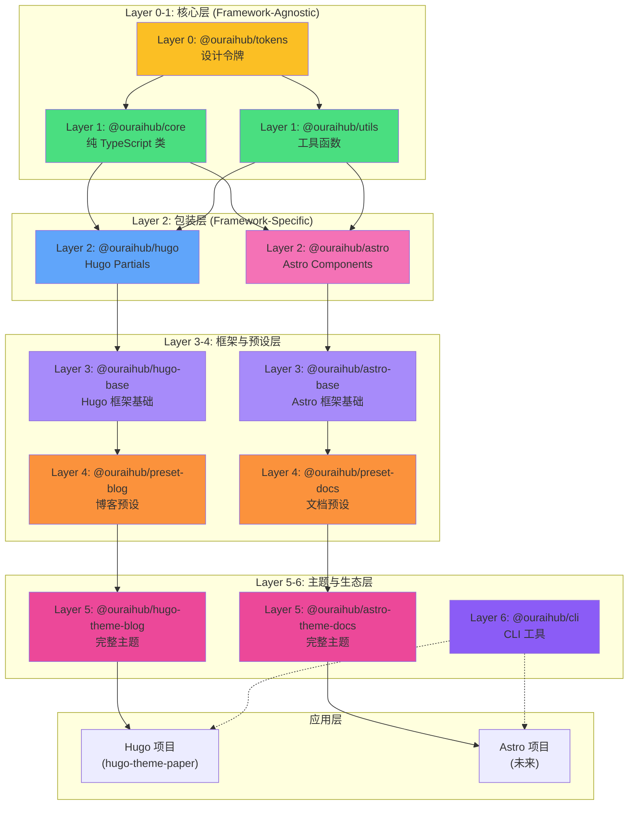
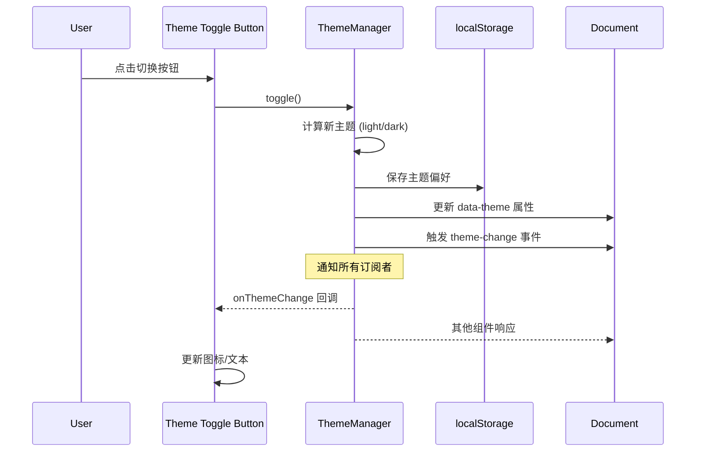

# @ouraihub/ui-library 完整设计方案

> **版本**: 1.6.0  
> **最后更新**: 2026-05-12  
> **状态**: approved  
> **维护者**: Sisyphus (AI Agent)

> **相关文档**: [项目概览](./analysis/01-projects-overview.md) | [代码重复分析](./analysis/02-code-duplication.md) | [Pagefind 研究](./architecture/01-pagefind-study.md) | [实施计划](./IMPLEMENTATION_PLAN.md) | [架构决策记录](./decisions/README.md) | [ADR-005: 六层架构](./decisions/005-six-layer-architecture.md)

## 执行摘要

基于对现有项目的深度分析、Oracle 的架构建议和 Pagefind Component UI 的实现研究，我们确定了最适合你场景的技术方案。

**详细分析**: 参见 [代码重复分析](./analysis/02-code-duplication.md) 了解重复代码统计，[Pagefind 研究](./architecture/01-pagefind-study.md) 了解设计灵感来源。

### 核心决策

| 决策点 | 选择 | 理由 |
|--------|------|------|
| **架构模式** | 六层架构（详见 ADR-005） | 清晰的职责划分，灵活的定制能力 |
| **Web Components** | ❌ 不使用 | SSG + Tailwind v4 场景不适合 |
| **核心逻辑** | 纯 TypeScript 类（Layer 1） | 100% 跨框架复用 |
| **UI 层** | Hugo partials + Astro 组件（Layer 2） | 原生语法，SEO 友好 |
| **样式方案** | CSS 变量 + Tailwind（Layer 0） | 主题化 + 工具类 |
| **构建工具** | esbuild + Turborepo | 快速构建 + Monorepo 优化 |

### 预期收益

- **代码复用**: 节省 ~2,000-2,800 行代码（70%+）
- **维护成本**: 降低 75%（修复一次生效全部）
- **开发效率**: 提升 300%（实现一次复用）
- **一致性**: 统一实现，统一体验

---

## 一、需求分析

### 1.1 功能需求（按优先级）

#### P0 - 极高重复度（必须完成）

**主题切换系统**
- 重复项目: 4个
- 重复代码: ~800-1,200 行
- 核心功能:
  - [ ] light/dark/system 三态切换
  - [ ] localStorage 持久化
  - [ ] 媒体查询监听
  - [ ] 防闪烁机制
  - [ ] 事件通知（主题变化时）

**DOM 工具函数**
- 重复项目: 3个
- 重复代码: ~300-500 行
- 核心功能:
  - [ ] querySelector/querySelectorAll 封装
  - [ ] debounce/throttle 函数
  - [ ] 事件委托
  - [ ] DOM ready 检测

**CSS 变量系统**
- 重复项目: 4个
- 重复代码: ~200-400 行
- 核心功能:
  - [ ] 统一的设计令牌（颜色、间距、字体）
  - [ ] 暗色主题支持
  - [ ] Tailwind 配置预设

#### P1 - 高重复度（强烈建议）

**导航菜单组件**
- 重复项目: 3个
- 重复代码: ~500-700 行
- 核心功能:
  - [ ] 移动端菜单切换
  - [ ] 下拉菜单
  - [ ] 滚动行为（隐藏/显示）
  - [ ] 响应式断点

**懒加载功能**
- 重复项目: 3个
- 重复代码: ~400-600 行
- 核心功能:
  - [ ] IntersectionObserver 封装
  - [ ] 图片懒加载
  - [ ] 内容懒加载
  - [ ] 占位符支持

**搜索功能**
- 重复项目: 2个
- 重复代码: ~300-400 行
- 核心功能:
  - [ ] 搜索模态框
  - [ ] 键盘快捷键（Ctrl+K）
  - [ ] 防抖搜索
  - [ ] 焦点管理

#### P2 - 中等重复度（可选）

**SEO 组件**
- 重复项目: 4个
- 重复代码: ~200-300 行
- 核心功能:
  - [ ] Meta 标签
  - [ ] Open Graph
  - [ ] Schema.org
  - [ ] Twitter Card

**表单验证**
- 重复项目: 2个
- 重复代码: ~100-200 行
- 核心功能:
  - [ ] URL 验证
  - [ ] Email 验证
  - [ ] 长度验证
  - [ ] 自定义规则

### 1.2 非功能需求

- **性能**: 初始加载 < 50KB，懒加载支持（详见 [性能优化策略](./IMPLEMENTATION_PLAN.md#task-22-性能优化策略)）
- **兼容性**: 现代浏览器（ES2020+）（详见 [浏览器兼容性矩阵](./IMPLEMENTATION_PLAN.md#task-15-浏览器兼容性矩阵)）
- **SEO**: 完全 SEO 友好（SSG 场景）
- **无障碍**: WCAG 2.1 AA 级别
- **类型安全**: 完整的 TypeScript 支持
- **文档**: 每个组件有使用示例（详见 [API 参考文档](./IMPLEMENTATION_PLAN.md#task-11-api-参考文档)）

---

## 二、架构设计

> **架构决策**: 采用六层架构设计，详见 [ADR-005: 六层架构设计](./decisions/005-six-layer-architecture.md)

### 2.1 整体架构

**参考**: 本架构设计受 [Pagefind Component UI](./architecture/01-pagefind-study.md) 启发，采用类似的事件驱动和 Owner-based 订阅模式。

#### 六层架构概览

```
Layer 6: Ecosystem（生态系统层）
    ↓
Layer 5: Themes（完整主题层）
    ↓
Layer 4: Presets（预设层）
    ↓
Layer 3: Framework Base（框架基础层）
    ↓
Layer 2: Components（组件包装层）
    ↓
Layer 1: Primitives（核心原语层）
    ↓
Layer 0: Design Tokens（设计令牌层）
```

#### 包结构映射

```
@ouraihub/ui-library/
│
├── packages/
│   │
│   ├── tokens/                      # 🎨 Layer 0: 设计令牌
│   │   ├── colors.ts
│   │   ├── spacing.ts
│   │   ├── typography.ts
│   │   └── index.ts
│   │
│   ├── core/                        # 🔧 Layer 1: 核心原语（纯 TypeScript）
│   │   ├── theme/
│   │   │   ├── ThemeManager.ts     # 主题管理类
│   │   │   └── index.ts
│   │   ├── search/
│   │   │   ├── SearchModal.ts      # 搜索模态框逻辑
│   │   │   └── index.ts
│   │   ├── navigation/
│   │   │   ├── NavigationController.ts
│   │   │   └── index.ts
│   │   ├── lazyload/
│   │   │   ├── LazyLoader.ts
│   │   │   └── index.ts
│   │   └── types/
│   │       └── index.ts
│   │
│   ├── utils/                       # 🔧 Layer 1: 工具函数
│   │   ├── dom.ts
│   │   ├── validation.ts
│   │   ├── formatters.ts
│   │   └── index.ts
│   │
│   ├── hugo/                        # 📄 Layer 2: Hugo 组件包装
│   │   ├── partials/
│   │   │   ├── theme-toggle.html
│   │   │   ├── search-modal.html
│   │   │   ├── navigation.html
│   │   │   └── lazy-image.html
│   │   ├── init.ts                 # 自动初始化脚本
│   │   └── package.json
│   │
│   ├── astro/                       # 🚀 Layer 2: Astro 组件包装
│   │   ├── components/
│   │   │   ├── ThemeToggle.astro
│   │   │   ├── SearchModal.astro
│   │   │   ├── Navigation.astro
│   │   │   └── LazyImage.astro
│   │   └── package.json
│   │
│   ├── hugo-base/                   # 🏗️ Layer 3: Hugo 框架基础
│   │   ├── layouts/
│   │   ├── styles/
│   │   └── config/
│   │
│   ├── astro-base/                  # 🏗️ Layer 3: Astro 框架基础
│   │   ├── layouts/
│   │   ├── styles/
│   │   └── config/
│   │
│   ├── preset-blog/                 # ⚙️ Layer 4: 博客预设
│   ├── preset-docs/                 # ⚙️ Layer 4: 文档预设
│   │
│   ├── hugo-theme-blog/             # 🎨 Layer 5: Hugo 博客主题
│   ├── astro-theme-docs/            # 🎨 Layer 5: Astro 文档主题
│   │
│   └── cli/                         # 🛠️ Layer 6: CLI 工具
│
├── docs/                            # 📚 文档
├── pnpm-workspace.yaml
├── turbo.json
└── package.json
```

#### 架构可视化



**架构优势**:
- 🎨 **Layer 0 统一设计** - 所有项目共享相同的设计令牌
- 🔧 **Layer 1 核心复用** - 100% 跨框架复用的业务逻辑
- 📦 **Layer 2 薄包装** - 框架特定代码最小化
- 🏗️ **Layer 3 框架基础** - 可复用的布局和样式系统
- ⚙️ **Layer 4 快速启动** - 预设提供最佳实践
- 🎨 **Layer 5 开箱即用** - 完整主题零配置启动
- 🛠️ **Layer 6 开发者体验** - CLI 和工具提升效率

### 2.2 核心设计模式（借鉴 Pagefind）

#### 模式 1: 清晰的类 API

```typescript
// 每个核心类都有清晰的接口
export class ThemeManager {
  constructor(element?: HTMLElement, options?: ThemeOptions);
  
  // 公共方法
  setTheme(mode: ThemeMode): void;
  getTheme(): ThemeMode;
  toggle(): void;
  
  // 事件订阅
  onThemeChange(callback: (theme: string) => void): () => void;
}
```

#### 模式 2: 自动初始化机制

**Hugo 方式**（参考 [Pagefind 的 data 属性自动初始化](./architecture/01-pagefind-study.md#自动初始化机制)）:
```html
<!-- partial 渲染标记 -->
<button data-ui-component="theme-toggle" 
        data-ui-storage-key="theme"
        class="...">
  切换主题
</button>

<!-- init.ts 自动扫描并初始化 -->
<script type="module" src="/js/ui-init.js"></script>
```

**Astro 方式**:
```astro
<button class="...">切换主题</button>
<script>
  import { ThemeManager } from '@ouraihub/core/theme';
  new ThemeManager(document.currentScript.previousElementSibling);
</script>
```

#### 模式 3: 事件驱动通信

```typescript
// 核心类支持事件订阅
const theme = new ThemeManager();

// 订阅主题变化
const unsubscribe = theme.onThemeChange((newTheme) => {
  console.log('主题已切换:', newTheme);
  // 其他组件可以响应
});

// 取消订阅
unsubscribe();
```

**事件流程可视化**:



#### 模式 4: Owner-based 订阅（防止内存泄漏）

**参考**: [Pagefind 的 Owner-based 订阅模式](./architecture/01-pagefind-study.md#owner-based-订阅)

```typescript
// 参考 Pagefind 的实现
class EventEmitter {
  private listeners = new Map<string, Array<{
    callback: Function;
    owner?: Element;
  }>>();
  
  on(event: string, callback: Function, owner?: Element) {
    if (owner) {
      // 替换同一 owner 的旧订阅
      const existing = this.listeners.get(event)?.find(
        l => l.owner === owner
      );
      if (existing) {
        existing.callback = callback;
        return;
      }
    }
    // 添加新订阅
  }
}
```

### 2.3 样式系统设计

> **设计原则**: 使用 CSS 变量而非 CSS-in-JS，原因详见 [ADR-003: CSS 变量 vs CSS-in-JS](./decisions/003-css-variables-over-css-in-js.md)（待创建）

#### CSS 变量主题化（参考 [Pagefind 的 CSS 变量系统](./architecture/01-pagefind-study.md#css-变量主题化)）

```css
:root {
  /* 颜色系统 */
  --ui-text: #1a1a1a;
  --ui-background: #ffffff;
  --ui-border: #e0e0e0;
  --ui-primary: #2937f0;
  
  /* 间距系统 */
  --ui-spacing-sm: 8px;
  --ui-spacing-md: 16px;
  --ui-spacing-lg: 24px;
  
  /* 其他设计令牌 */
  --ui-radius-md: 6px;
  --ui-shadow-sm: 0 2px 8px rgba(0, 0, 0, 0.06);
}

[data-theme="dark"] {
  --ui-text: #e5e5e5;
  --ui-background: #1a1a1a;
  --ui-border: #404040;
}
```

#### Tailwind 集成

```javascript
// tailwind-preset.js
export default {
  theme: {
    extend: {
      colors: {
        'ui-text': 'var(--ui-text)',
        'ui-bg': 'var(--ui-background)',
        'ui-primary': 'var(--ui-primary)',
      },
      spacing: {
        'ui-sm': 'var(--ui-spacing-sm)',
        'ui-md': 'var(--ui-spacing-md)',
      },
    },
  },
};
```

---

## 三、技术规范

### 3.1 核心逻辑层规范

**文件组织**:
```
core/
├── [feature]/
│   ├── [Feature]Manager.ts    # 主类
│   ├── types.ts               # 类型定义
│   ├── [Feature]Manager.test.ts  # 单元测试
│   └── index.ts               # 导出
```

**类设计规范**:
```typescript
// 1. 清晰的构造函数
constructor(element?: HTMLElement, options?: FeatureOptions)

// 2. 公共方法（动词开头）
setXxx(), getXxx(), toggle(), update()

// 3. 事件订阅（on 前缀）
onXxxChange(callback: Function): () => void

// 4. 私有方法（_ 前缀）
private _init(), private _apply()
```

**TypeScript 配置**:
```json
{
  "compilerOptions": {
    "target": "ES2020",
    "module": "ESNext",
    "lib": ["ES2020", "DOM"],
    "strict": true,
    "declaration": true,
    "declarationMap": true
  }
}
```

### 3.2 Hugo 包装层规范

**Partial 命名**:
- `theme-toggle.html` - 主题切换按钮
- `search-modal.html` - 搜索模态框
- `navigation.html` - 导航栏

**Data 属性约定**:
```html
<element 
  data-ui-component="component-name"
  data-ui-option-name="value">
</element>
```

**初始化脚本**:
```typescript
// init.ts
import { ThemeManager } from '@ouraihub/core/theme';

document.addEventListener('DOMContentLoaded', () => {
  // 扫描并初始化所有组件
  document.querySelectorAll('[data-ui-component="theme-toggle"]')
    .forEach(el => {
      const options = {
        storageKey: el.dataset.uiStorageKey || 'theme',
        attribute: el.dataset.uiAttribute || 'data-theme',
      };
      new ThemeManager(el as HTMLElement, options);
    });
});
```

### 3.3 Astro 包装层规范

**组件命名**: PascalCase（`ThemeToggle.astro`）

**组件结构**:
```astro
---
// Props 定义
interface Props {
  storageKey?: string;
  attribute?: string;
}

const { storageKey = 'theme', attribute = 'data-theme' } = Astro.props;
---

<!-- HTML 标记 -->
<button class="...">切换主题</button>

<!-- 客户端脚本 -->
<script>
  import { ThemeManager } from '@ouraihub/core/theme';
  
  const button = document.currentScript?.previousElementSibling;
  if (button) {
    new ThemeManager(button as HTMLElement, {
      storageKey: button.dataset.storageKey,
      attribute: button.dataset.attribute,
    });
  }
</script>
```

### 3.4 构建配置

**esbuild 配置**:
```javascript
// packages/core/build.js
import esbuild from 'esbuild';

// ESM 构建
await esbuild.build({
  entryPoints: ['src/index.ts'],
  outdir: 'dist/esm',
  format: 'esm',
  platform: 'neutral',
  target: 'es2020',
  bundle: true,
  splitting: true,
  outExtension: { '.js': '.mjs' },
});

// CJS 构建
await esbuild.build({
  entryPoints: ['src/index.ts'],
  outdir: 'dist/cjs',
  format: 'cjs',
  platform: 'neutral',
  target: 'es2020',
  bundle: true,
  outExtension: { '.js': '.cjs' },
});
```

**Package.json 导出**:
```json
{
  "name": "@ouraihub/core",
  "type": "module",
  "main": "./dist/cjs/index.cjs",
  "module": "./dist/esm/index.mjs",
  "types": "./dist/types/index.d.ts",
  "exports": {
    ".": {
      "types": "./dist/types/index.d.ts",
      "import": "./dist/esm/index.mjs",
      "require": "./dist/cjs/index.cjs"
    },
    "./theme": "./dist/esm/theme/index.mjs",
    "./utils": "./dist/esm/utils/index.mjs"
  },
  "sideEffects": false
}
```

---

## 四、关键设计决策

### 4.1 为什么不使用 Web Components？

**Oracle 的分析**:
- ❌ SSG 场景下 SEO 不友好（内容在 JS 执行后才渲染）
- ❌ Tailwind v4 与 Shadow DOM 集成复杂
- ❌ 需要 Declarative Shadow DOM（浏览器支持有限）
- ❌ 初始化时机问题（需要等待 JS 加载）

**我们的方案**:
- ✅ 核心逻辑用纯 TypeScript 类（100% 复用）
- ✅ UI 层用框架原生语法（SEO 友好）
- ✅ 初始 HTML 完整可见（搜索引擎直接索引）
- ✅ JS 只负责增强交互（渐进增强）

### 4.2 为什么选择薄包装层？

**对比分析**:

| 方案 | 复用度 | 开发体验 | 维护成本 |
|------|--------|---------|---------|
| 完全框架专用 | 0% | ⭐⭐⭐⭐⭐ | 高 |
| 纯 Web Components | 100% | ⭐⭐⭐ | 低 |
| **薄包装层** | **95%** | **⭐⭐⭐⭐** | **低** |

**薄包装层的优势**:
- 核心逻辑 100% 复用（写一次）
- UI 层代码量小（主要是模板 + 初始化）
- 使用框架原生语法（开发体验好）
- 维护成本远低于完全框架专用

### 4.3 为什么参考 Pagefind？

**Pagefind 的优势**:
- ✅ 生产级别的实现（被数千网站使用）
- ✅ 清晰的架构模式（Instance Manager + 事件系统）
- ✅ 完善的性能优化（懒加载、预加载、防抖）
- ✅ 优秀的无障碍支持（ARIA、键盘导航）
- ✅ 灵活的定制能力（CSS 变量、模板系统）

**我们借鉴的部分**:
- ✅ 清晰的类 API 设计
- ✅ 事件驱动的组件通信
- ✅ Owner-based 订阅（防止内存泄漏）
- ✅ Data 属性自动初始化
- ✅ CSS 变量主题化

**我们不借鉴的部分**:
- ❌ Web Components（我们用薄包装层）
- ❌ 复杂的模板系统（我们用框架原生模板）
- ❌ Shadow DOM 样式隔离（我们用 Light DOM）

---

## 五、实施计划

### 5.1 阶段划分

**阶段 0: 准备（1天）**
- [ ] 创建 Monorepo 结构
- [ ] 配置 Turborepo
- [ ] 配置 TypeScript
- [ ] 配置构建工具

**阶段 1: 核心工具（1周）**
- [ ] 实现 ThemeManager
- [ ] 实现 DOM 工具函数
- [ ] 创建 CSS 变量系统
- [ ] 编写单元测试

**阶段 2: Hugo 包装层（3天）**
- [ ] 创建 theme-toggle.html
- [ ] 创建 init.ts
- [ ] 在 hugo-theme-paper 中测试

**阶段 3: Astro 包装层（3天）**
- [ ] 创建 ThemeToggle.astro
- [ ] 在 astro-nav-monorepo 中测试

**阶段 4: 其他组件（2-3周）**
- [ ] 导航菜单
- [ ] 搜索功能
- [ ] 懒加载
- [ ] SEO 组件

### 5.2 验收标准

**每个组件完成的标准**:
- [ ] 核心类实现完成
- [ ] 单元测试通过（覆盖率 > 80%）
- [ ] Hugo partial 实现完成
- [ ] Astro 组件实现完成
- [ ] 在至少一个项目中验证可用
- [ ] API 文档编写完成
- [ ] 使用示例编写完成

---

## 六、风险与应对

| 风险 | 影响 | 概率 | 应对措施 |
|------|------|------|---------|
| 初始化时机问题 | 中 | 中 | 使用 DOMContentLoaded + 防御性编程 |
| 样式冲突 | 低 | 低 | 使用 CSS 变量 + 命名空间 |
| 兼容性问题 | 低 | 低 | 目标现代浏览器，充分测试 |
| 学习曲线 | 低 | 低 | AI 辅助开发，文档完善 |

---

## 七、成功指标

### 7.1 量化指标

- **代码复用率**: > 70%
- **维护成本降低**: > 75%
- **构建时间**: < 5秒
- **包体积**: < 50KB (gzipped)
- **测试覆盖率**: > 80%

### 7.2 质量指标

- **类型安全**: 100% TypeScript 覆盖
- **无障碍**: WCAG 2.1 AA 级别
- **SEO**: 完全 SEO 友好
- **性能**: Lighthouse 分数 > 90

---

## 八、下一步行动

1. **补充文档** - 完成 [实施计划](./IMPLEMENTATION_PLAN.md) 中的 P0/P1 文档
2. **创建 Monorepo** - 参考 [组件库架构设计](./architecture/02-component-library-design.md)
3. **实现核心组件** - 从 ThemeManager 开始（详见 [快速开始指南](./implementation/02-quick-start.md)）
4. **迁移验证** - 在 hugo-theme-paper 中验证

**相关文档**:
- [实施计划](./IMPLEMENTATION_PLAN.md) - 文档补充任务清单
- [实施路线图](./implementation/01-roadmap.md) - 完整开发计划
- [快速开始](./implementation/02-quick-start.md) - 30分钟创建第一个组件

---

**文档版本**: v1.1  
**最后更新**: 2026-05-12  
**维护者**: Sisyphus (AI Agent)
