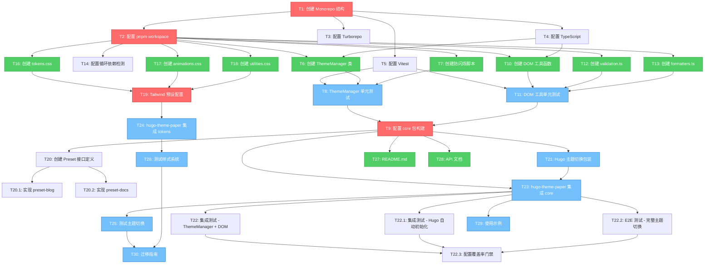

# 实施路线图 - 基于依赖关系

> **版本**: 2.0.0  
> **最后更新**: 2026-05-12  
> **状态**: approved  
> **维护者**: Sisyphus (AI Agent)

## 概述

本路线图基于**任务依赖关系**而非时间估算。所有任务由 AI 完成，关注点在于：
- 任务的原子性和完成标准
- 任务之间的依赖关系
- 并行执行能力
- 阻塞性分析

**关键指标**：
- **总任务数**: 38 个原子任务（新增 8 个任务）
- **关键路径长度**: 9 个任务
- **最大并行度**: 9 个任务（Batch 2）
- **预期代码复用**: ~2,000-2,800 行代码（70%+）

**更新日志**：
- 2026-05-12: 基于第五轮 Oracle 评审，新增 8 个任务
  - T14: 配置循环依赖检测（Critical 修复）
  - T20, T20.1, T20.2: Preset 层实施（Critical 修复）
  - T22, T22.1, T22.2, T22.3: 集成测试和 E2E 测试（Critical 修复）

---

## 任务依赖图



**图例**：
- 🔴 **Blocking**（红色）：阻塞其他任务的关键任务
- 🟢 **Independent**（绿色）：可并行执行的独立任务
- 🔵 **Dependent**（蓝色）：依赖其他任务的任务

---

## 关键路径分析

### 最长依赖链（关键路径）

**主题系统路径**：
```
T1 → T2 → T6,T7 → T8 → T9 → T21 → T23 → T25 → T30
```
**链长**：9 个任务

**样式系统路径**：
```
T1 → T2 → T16,T17,T18 → T19 → T24 → T26 → T30
```
**链长**：7 个任务

**关键路径**：主题系统路径（9 个任务）

---

## 并行执行计划

### Batch 1: 基础设施

**阻塞性**: Blocking（阻塞所有后续任务）  
**并行能力**: 必须串行  
**依赖**: 无

**任务**：
- [ ] **T1: 创建 Monorepo 结构**
  - 复杂度: Simple
  - 依赖数量: 0
  - 阻塞: 所有任务
  - 完成标准:
    - [ ] 创建 `ui-library/` 目录
    - [ ] 创建 `packages/` 目录
    - [ ] 创建根 `package.json`
    - [ ] 初始化 git 仓库

- [ ] **T2: 配置 pnpm workspace**
  - 复杂度: Simple
  - 依赖数量: 1（T1）
  - 阻塞: T6, T7, T10, T12, T13, T16, T17, T18
  - 完成标准:
    - [ ] 创建 `pnpm-workspace.yaml`
    - [ ] 配置 `packages/*` 路径
    - [ ] 运行 `pnpm install` 成功

- [ ] **T3: 配置 Turborepo**
  - 复杂度: Simple
  - 依赖数量: 1（T1）
  - 阻塞: 构建流程
  - 完成标准:
    - [ ] 创建 `turbo.json`
    - [ ] 配置 `build` pipeline
    - [ ] 配置 `test` pipeline
    - [ ] 配置 `dev` pipeline

- [ ] **T4: 配置 TypeScript**
  - 复杂度: Simple
  - 依赖数量: 1（T1）
  - 阻塞: T6, T10（所有 TS 代码）
  - 完成标准:
    - [ ] 创建根 `tsconfig.json`
    - [ ] 配置 `strict: true`
    - [ ] 配置 `paths` 别名
    - [ ] 运行 `tsc --noEmit` 成功

- [ ] **T5: 配置 Vitest**
  - 复杂度: Simple
  - 依赖数量: 1（T1）
  - 阻塞: T8, T11（所有测试）
  - 完成标准:
    - [ ] 创建 `vitest.config.ts`
    - [ ] 配置 jsdom 环境
    - [ ] 配置 test/setup.ts
    - [ ] Mock localStorage
    - [ ] Mock matchMedia
    - [ ] 运行 `pnpm test` 成功

- [ ] **T14: 配置循环依赖检测**
  - 复杂度: Simple
  - 依赖数量: 1（T2）
  - 阻塞: 所有后续任务（防止引入循环依赖）
  - 完成标准:
    - [ ] 安装 madge: `pnpm add -Dw madge`
    - [ ] 创建检测脚本 `scripts/check-circular-deps.js`
    - [ ] 添加 npm script: `"check:circular": "node scripts/check-circular-deps.js"`
    - [ ] 创建 `.github/workflows/check-circular-deps.yml`
    - [ ] 创建 `.husky/pre-commit` hook
    - [ ] 运行检测，确保无循环依赖
    - [ ] 测试 pre-commit hook 是否生效

---

### Batch 2: 核心实现（高度并行）

**阻塞性**: Independent（可并行）  
**并行能力**: 最多 9 个任务并行  
**依赖**: Batch 1 完成

#### 并行组 A: 主题系统

- [ ] **T6: 创建 ThemeManager 类**
  - 复杂度: Medium
  - 依赖数量: 2（T2, T4）
  - 阻塞: T8, T9, T21
  - 并行能力: 可与 T10, T16 并行
  - 完成标准:
    - [ ] 创建 `packages/core/src/theme/ThemeManager.ts`
    - [ ] 实现 `setTheme()` 方法
    - [ ] 实现 `getTheme()` 方法
    - [ ] 实现 `toggle()` 方法
    - [ ] 实现 `onThemeChange()` 事件订阅
    - [ ] 支持 light/dark/system 三态
    - [ ] localStorage 持久化
    - [ ] 媒体查询监听
    - [ ] 完整的 TypeScript 类型定义

- [ ] **T7: 创建防闪烁脚本**
  - 复杂度: Simple
  - 依赖数量: 1（T2）
  - 阻塞: T8
  - 并行能力: 可与 T6 并行
  - 完成标准:
    - [ ] 创建 `packages/core/src/theme/toggle-theme.ts`
    - [ ] 实现同步主题读取
    - [ ] 实现 DOM 属性设置
    - [ ] 代码可内联到 `<head>`
    - [ ] 无依赖（纯 JS）

#### 并行组 B: DOM 工具

- [ ] **T10: 创建 DOM 工具函数**
  - 复杂度: Medium
  - 依赖数量: 2（T2, T4）
  - 阻塞: T11, T9
  - 并行能力: 可与 T6, T16 并行
  - 完成标准:
    - [ ] 创建 `packages/core/src/utils/dom.ts`
    - [ ] 实现 `qs()` - querySelector 封装
    - [ ] 实现 `qsa()` - querySelectorAll 封装
    - [ ] 实现 `debounce()` 函数
    - [ ] 实现 `throttle()` 函数
    - [ ] 实现 `ready()` - DOM ready 检测
    - [ ] 实现 `on()` - 事件委托
    - [ ] 完整的 TypeScript 泛型支持

- [ ] **T12: 创建 validation.ts**
  - 复杂度: Simple
  - 依赖数量: 2（T2, T4）
  - 阻塞: T11
  - 并行能力: 可与 T10, T13 并行
  - 完成标准:
    - [ ] 创建 `packages/core/src/utils/validation.ts`
    - [ ] 实现 `validateUrl()` - URL 验证
    - [ ] 实现 `validateEmail()` - Email 验证
    - [ ] 实现 `validateRequired()` - 非空验证
    - [ ] 实现 `validateLength()` - 长度验证
    - [ ] 完整的类型定义

- [ ] **T13: 创建 formatters.ts**
  - 复杂度: Simple
  - 依赖数量: 2（T2, T4）
  - 阻塞: T11
  - 并行能力: 可与 T10, T12 并行
  - 完成标准:
    - [ ] 创建 `packages/core/src/utils/formatters.ts`
    - [ ] 实现 `formatUrl()` - URL 格式化
    - [ ] 实现 `formatDate()` - 日期格式化
    - [ ] 实现 `formatFileSize()` - 文件大小格式化
    - [ ] 实现 `generateSlug()` - slug 生成
    - [ ] 完整的类型定义

#### 并行组 C: CSS 变量（Tokens 包）

- [ ] **T16: 创建 tokens.css**
  - 复杂度: Simple
  - 依赖数量: 1（T2）
  - 阻塞: T19
  - 并行能力: 可与 T6, T10 并行
  - 完成标准:
    - [ ] 创建 `packages/tokens/src/tokens.css`
    - [ ] 定义颜色变量（light/dark）
    - [ ] 定义间距变量
    - [ ] 定义字体变量
    - [ ] 定义圆角变量
    - [ ] 定义阴影变量
    - [ ] 支持 `[data-theme="dark"]` 切换

- [ ] **T17: 创建 animations.css**
  - 复杂度: Simple
  - 依赖数量: 1（T2）
  - 阻塞: T19
  - 并行能力: 可与 T16, T18 并行
  - 完成标准:
    - [ ] 创建 `packages/tokens/src/animations.css`
    - [ ] 定义 fade-in 动画
    - [ ] 定义 slide-in 动画
    - [ ] 定义 scale 动画
    - [ ] 定义过渡时长变量

- [ ] **T18: 创建 utilities.css**
  - 复杂度: Simple
  - 依赖数量: 1（T2）
  - 阻塞: T19
  - 并行能力: 可与 T16, T17 并行
  - 完成标准:
    - [ ] 创建 `packages/tokens/src/utilities.css`
    - [ ] 定义常用工具类
    - [ ] 定义响应式断点
    - [ ] 定义可访问性工具类

---

### Batch 3: 测试层（可并行）

**阻塞性**: Dependent  
**并行能力**: 3 个任务并行  
**依赖**: Batch 2 完成

- [ ] **T8: ThemeManager 单元测试**
  - 复杂度: Medium
  - 依赖数量: 3（T5, T6, T7）
  - 阻塞: T9
  - 并行能力: 可与 T11, T19 并行
  - 完成标准:
    - [ ] 创建 `packages/core/src/theme/ThemeManager.test.ts`
    - [ ] 测试初始化
    - [ ] 测试 setTheme()
    - [ ] 测试 getTheme()
    - [ ] 测试 toggle()
    - [ ] 测试 onThemeChange()
    - [ ] 测试 localStorage 持久化
    - [ ] 测试媒体查询监听
    - [ ] 测试边界情况
    - [ ] 覆盖率 > 90%

- [ ] **T11: DOM 工具单元测试**
  - 复杂度: Medium
  - 依赖数量: 4（T5, T10, T12, T13）
  - 阻塞: T9
  - 并行能力: 可与 T8, T19 并行
  - 完成标准:
    - [ ] 创建 `packages/core/src/utils/dom.test.ts`
    - [ ] 测试所有 DOM 工具函数
    - [ ] 测试所有 validation 函数
    - [ ] 测试所有 formatter 函数
    - [ ] 测试边界情况
    - [ ] 覆盖率 > 90%

- [ ] **T19: Tailwind 预设配置**
  - 复杂度: Simple
  - 依赖数量: 3（T16, T17, T18）
  - 阻塞: T24
  - 并行能力: 可与 T8, T11 并行
  - 完成标准:
    - [ ] 创建 `packages/tokens/tailwind-preset.js`
    - [ ] 映射 CSS 变量到 Tailwind
    - [ ] 配置 colors
    - [ ] 配置 spacing
    - [ ] 配置 borderRadius
    - [ ] 配置 boxShadow
    - [ ] 测试预设可用

---

### Batch 4: 构建配置（串行）

**阻塞性**: Blocking  
**并行能力**: 必须串行  
**依赖**: Batch 3 完成（所有测试通过）

- [ ] **T9: 配置 core 包构建**
  - 复杂度: Medium
  - 依赖数量: 2（T8, T11）
  - 阻塞: T20, T21, T23, T27, T28
  - 完成标准:
    - [ ] 创建 `packages/core/build.js`
    - [ ] 配置 esbuild（ESM + CJS）
    - [ ] 配置 TypeScript 类型生成
    - [ ] 配置 package.json exports
    - [ ] 配置 sideEffects: false
    - [ ] 运行 `pnpm build` 成功
    - [ ] 验证产物：dist/esm/, dist/cjs/, dist/types/
    - [ ] 验证 Tree-shaking 有效

---

### Batch 4.5: Preset 层实施

**阻塞性**: Dependent  
**并行能力**: 2 个任务并行  
**依赖**: Batch 4 完成

- [ ] **T20: 创建 Preset 接口定义**
  - 复杂度: Simple
  - 依赖数量: 1（T9）
  - 阻塞: T20.1, T20.2
  - 完成标准:
    - [ ] 创建 `packages/core/src/preset/types.ts`
    - [ ] 定义 Preset 接口
    - [ ] 定义 DesignTokens 接口
    - [ ] 定义 PresetOptions 接口
    - [ ] 导出类型定义
    - [ ] 编写 JSDoc 注释

- [ ] **T20.1: 实现 @ouraihub/preset-blog**
  - 复杂度: Medium
  - 依赖数量: 1（T20）
  - 阻塞: 无
  - 并行能力: 可与 T20.2 并行
  - 完成标准:
    - [ ] 创建 `packages/preset-blog/` 目录
    - [ ] 创建 `src/index.ts`
    - [ ] 定义博客预设配置（tokens、components、layouts）
    - [ ] 配置 package.json
    - [ ] 编写 README.md
    - [ ] 提供使用示例
    - [ ] 构建并验证

- [ ] **T20.2: 实现 @ouraihub/preset-docs**
  - 复杂度: Medium
  - 依赖数量: 1（T20）
  - 阻塞: 无
  - 并行能力: 可与 T20.1 并行
  - 完成标准:
    - [ ] 创建 `packages/preset-docs/` 目录
    - [ ] 创建 `src/index.ts`
    - [ ] 定义文档预设配置（tokens、components、layouts）
    - [ ] 配置 package.json
    - [ ] 编写 README.md
    - [ ] 提供使用示例
    - [ ] 构建并验证

---

### Batch 5: 包装和集成（可并行）

**阻塞性**: Dependent  
**并行能力**: 部分并行  
**依赖**: Batch 4 完成

- [ ] **T21: Hugo 主题切换包装**
  - 复杂度: Medium
  - 依赖数量: 1（T9）
  - 阻塞: T23
  - 并行能力: 可与 T24 并行
  - 完成标准:
    - [ ] 创建 `packages/hugo/partials/theme-toggle.html`
    - [ ] 创建 `packages/hugo/init.ts`
    - [ ] 实现自动初始化逻辑
    - [ ] 支持 data 属性配置
    - [ ] 测试在 Hugo 项目中可用

- [ ] **T23: hugo-theme-paper 集成 core**
  - 复杂度: Medium
  - 依赖数量: 2（T9, T21）
  - 阻塞: T22, T22.1, T22.2, T25, T29
  - 并行能力: 可与 T24 并行
  - 完成标准:
    - [ ] 安装 @ouraihub/core
    - [ ] 替换旧的主题切换代码
    - [ ] 集成 Hugo 包装层
    - [ ] 验证功能正常

- [ ] **T24: hugo-theme-paper 集成 tokens**
  - 复杂度: Simple
  - 依赖数量: 1（T19）
  - 阻塞: T26
  - 并行能力: 可与 T21, T23 并行
  - 完成标准:
    - [ ] 安装 @ouraihub/tokens
    - [ ] 导入 tokens.css
    - [ ] 导入 animations.css
    - [ ] 配置 Tailwind 预设
    - [ ] 验证样式正常

---

### Batch 5.5: 集成测试和 E2E 测试

**阻塞性**: Dependent  
**并行能力**: 3 个任务并行  
**依赖**: Batch 5 完成

- [ ] **T22: 集成测试 - ThemeManager + DOM 工具**
  - 复杂度: Medium
  - 依赖数量: 1（T23）
  - 阻塞: T22.3
  - 并行能力: 可与 T22.1, T22.2 并行
  - 完成标准:
    - [ ] 创建 `packages/core/__tests__/integration/theme-dom.test.ts`
    - [ ] 测试 ThemeManager 与 DOM 工具的集成
    - [ ] 测试事件系统与 DOM 操作的交互
    - [ ] 测试多个实例的协同工作
    - [ ] 测试内存泄漏（事件监听器清理）
    - [ ] 覆盖率 > 85%

- [ ] **T22.1: 集成测试 - Hugo 包装层自动初始化**
  - 复杂度: Medium
  - 依赖数量: 1（T23）
  - 阻塞: T22.3
  - 并行能力: 可与 T22, T22.2 并行
  - 完成标准:
    - [ ] 创建 `packages/hugo/__tests__/integration/auto-init.test.ts`
    - [ ] 测试 data 属性自动扫描
    - [ ] 测试多个组件同时初始化
    - [ ] 测试初始化顺序
    - [ ] 测试错误处理（无效配置）
    - [ ] 使用 jsdom 模拟 Hugo 生成的 HTML

- [ ] **T22.2: E2E 测试 - 完整主题切换流程**
  - 复杂度: Medium
  - 依赖数量: 1（T23）
  - 阻塞: T22.3
  - 并行能力: 可与 T22, T22.1 并行
  - 完成标准:
    - [ ] 安装并配置 Playwright
    - [ ] 创建 `packages/hugo/__tests__/e2e/theme-toggle.spec.ts`
    - [ ] 测试用户点击主题切换按钮
    - [ ] 测试主题持久化（刷新页面）
    - [ ] 测试系统主题跟随
    - [ ] 测试跨页面主题一致性
    - [ ] 测试防闪烁机制
    - [ ] 在真实 Hugo 项目中运行

- [ ] **T22.3: 配置测试覆盖率门禁**
  - 复杂度: Simple
  - 依赖数量: 3（T22, T22.1, T22.2）
  - 阻塞: 无
  - 完成标准:
    - [ ] 更新 `vitest.config.ts` 配置覆盖率阈值（80%+）
    - [ ] 创建 `.github/workflows/test.yml`
    - [ ] 集成 Codecov 上传覆盖率报告
    - [ ] 添加覆盖率徽章到 README
    - [ ] 配置 PR 评论显示覆盖率变化
    - [ ] 验证覆盖率门禁生效

---

### Batch 6: 验证测试（可并行）

**阻塞性**: Dependent  
**并行能力**: 2 个任务并行  
**依赖**: Batch 5.5 完成

- [ ] **T25: 手动验证主题切换**
  - 复杂度: Simple
  - 依赖数量: 1（T22.3）
  - 阻塞: T30
  - 并行能力: 可与 T26 并行
  - 完成标准:
    - [ ] 在多个浏览器中手动测试（Chrome、Firefox、Safari）
    - [ ] 验证 localStorage 持久化
    - [ ] 验证媒体查询监听
    - [ ] 验证防闪烁机制
    - [ ] 验证跨页面一致性
    - [ ] 记录测试结果

- [ ] **T26: 手动验证样式系统**
  - 复杂度: Simple
  - 依赖数量: 1（T24）
  - 阻塞: T30
  - 并行能力: 可与 T25 并行
  - 完成标准:
    - [ ] 验证 CSS 变量生效
    - [ ] 验证暗色主题切换
    - [ ] 验证 Tailwind 预设
    - [ ] 验证动画效果
    - [ ] 验证响应式布局
    - [ ] 记录测试结果

---

### Batch 7: 文档（高度并行）

**阻塞性**: Independent/Dependent  
**并行能力**: 4 个任务并行  
**依赖**: 部分依赖 Batch 4-6

- [ ] **T27: README.md**
  - 复杂度: Simple
  - 依赖数量: 1（T9）
  - 阻塞: 无
  - 并行能力: 可与 T28, T29, T30 并行
  - 完成标准:
    - [ ] 创建项目 README.md
    - [ ] 项目简介
    - [ ] 快速开始
    - [ ] 安装说明
    - [ ] 基本使用示例
    - [ ] 链接到详细文档

- [ ] **T28: API 文档**
  - 复杂度: Simple
  - 依赖数量: 1（T9）
  - 阻塞: 无
  - 并行能力: 可与 T27, T29, T30 并行
  - 完成标准:
    - [ ] 创建 docs/api/README.md
    - [ ] ThemeManager API 文档
    - [ ] DOM 工具 API 文档
    - [ ] Validation API 文档
    - [ ] Formatter API 文档
    - [ ] 类型定义说明

- [ ] **T29: 使用示例**
  - 复杂度: Simple
  - 依赖数量: 1（T23）
  - 阻塞: 无
  - 并行能力: 可与 T27, T28, T30 并行
  - 完成标准:
    - [ ] 创建示例代码
    - [ ] Hugo 使用示例
    - [ ] Astro 使用示例
    - [ ] 常见场景示例
    - [ ] 代码注释完整

- [ ] **T30: 迁移指南**
  - 复杂度: Simple
  - 依赖数量: 2（T25, T26）
  - 阻塞: 无
  - 并行能力: 可与 T27, T28, T29 并行
  - 完成标准:
    - [ ] 创建 docs/guides/migration.md
    - [ ] 迁移步骤说明
    - [ ] 常见问题解答
    - [ ] 回滚方案
    - [ ] 渐进式迁移策略

---

## 任务属性说明

### 复杂度分类

- **Simple**: 直接实现，无复杂逻辑，单一职责
- **Medium**: 需要设计，涉及多个子功能，需要测试
- **Complex**: 涉及多个子系统，需要架构设计，复杂的测试场景

### 阻塞性分类

- **Blocking**: 阻塞其他任务，必须优先完成
- **Independent**: 独立任务，可随时并行执行
- **Dependent**: 依赖其他任务，等待依赖完成后执行

### 并行能力

- **必须串行**: 任务之间有强依赖，必须按顺序执行
- **可并行**: 任务之间无依赖，可同时执行
- **部分并行**: 部分任务可并行，部分必须串行

---

## 执行策略

### 最大化并行度

1. **Batch 2 并行执行**：启动 3 组并行任务（主题系统、DOM 工具、CSS 变量）
2. **Batch 3 并行执行**：同时运行 3 个测试任务
3. **Batch 5 部分并行**：T21 和 T24 可并行，T23 等待 T21
4. **Batch 7 完全并行**：4 个文档任务同时执行

### 缩短关键路径

1. **提前准备构建配置**：在 T8 执行时准备 T9 的构建脚本
2. **提前启动文档**：T27, T28 可在 T9 完成后立即开始
3. **延迟非关键任务**：T30 不在关键路径上，可最后完成

### 风险控制

1. **测试门禁**：T9 必须等待所有测试通过（T8, T11）
2. **构建验证**：T9 完成后验证产物正确性
3. **集成测试**：T25, T26 验证实际使用场景

---

## 里程碑

### M1: 基础设施完成
**完成标准**: Batch 1 所有任务完成  
**验证**: 运行 `pnpm install` 和 `pnpm test` 成功

### M2: 核心功能完成
**完成标准**: Batch 2-3 所有任务完成  
**验证**: 所有单元测试通过，覆盖率 > 90%

### M3: 构建系统完成
**完成标准**: Batch 4 完成  
**验证**: 构建产物正确，可被其他包引用

### M4: 集成验证完成
**完成标准**: Batch 5-6 所有任务完成  
**验证**: hugo-theme-paper 成功集成，功能正常

### M5: 文档完成
**完成标准**: Batch 7 所有任务完成  
**验证**: 文档完整，示例可运行

---

## 相关文档

- [架构设计](../DESIGN.md) - 完整的架构设计方案
- [六层架构](../decisions/005-six-layer-architecture.md) - 架构决策记录
- [错误处理](../guides/error-handling.md) - 错误处理策略
- [安全性](../security/README.md) - 安全防护指南

---

**维护者**: Sisyphus (AI Agent)  
**最后更新**: 2026-05-12
