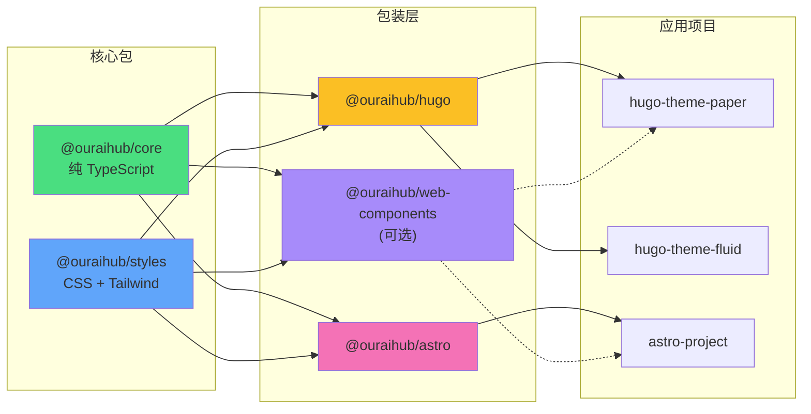

# 组件库架构设计方案

> **版本**: 1.4.0  
> **最后更新**: 2026-05-12  
> **状态**: approved  
> **维护者**: Sisyphus (AI Agent)

## 设计目标

基于对现有项目的分析和 Pagefind 的最佳实践研究，设计一个：

- ✅ **高复用性** - 最大化代码复用，减少重复
- ✅ **易维护** - 统一实现，修复一次生效全部
- ✅ **跨框架** - 支持 Hugo、Astro 及未来的框架
- ✅ **渐进式** - 可逐步迁移，不影响现有项目
- ✅ **类型安全** - 完整的 TypeScript 支持

---

## 推荐架构：混合分层架构

### 架构图

```
@your-org/ui-library/
│
├── packages/
│   │
│   ├── core/                        # 🔧 核心工具包（框架无关）
│   │   ├── theme/                  # 主题切换系统
│   │   │   ├── ThemeManager.ts    # 主题管理类
│   │   │   └── toggle-theme.ts    # 防闪烁脚本
│   │   ├── utils/                  # 工具函数
│   │   │   ├── dom.ts             # DOM 操作
│   │   │   ├── validation.ts      # 数据验证
│   │   │   └── formatters.ts      # 格式化
│   │   └── types/                  # TypeScript 类型
│   │       └── index.ts
│   │
│   ├── styles/                      # 🎨 设计系统
│   │   ├── tokens.css             # CSS 变量（设计令牌）
│   │   ├── animations.css         # 动画关键帧
│   │   ├── utilities.css          # 工具类
│   │   └── tailwind-preset.js     # Tailwind 配置预设
│   │
│   ├── web-components/              # 🧩 Web Components（可选）
│   │   ├── base-element.ts        # 基类
│   │   ├── theme-toggle.ts        # <ui-theme-toggle>
│   │   ├── search-modal.ts        # <ui-search-modal>
│   │   └── lazy-image.ts          # <ui-lazy-image>
```

#### 包依赖关系图



**依赖说明**:
- **实线箭头** - 必需依赖
- **虚线箭头** - 可选依赖（Web Components 可作为增强）
- **核心包零依赖** - `@ouraihub/core` 和 `@ouraihub/styles` 不依赖任何框架
- **包装层轻量** - Hugo/Astro 包仅依赖核心包，无其他外部依赖
@your-org/ui-library/
│
├── packages/
│   │
│   ├── core/                        # 🔧 核心工具包（框架无关）
│   │   ├── theme/                  # 主题切换系统
│   │   │   ├── ThemeManager.ts    # 主题管理类
│   │   │   └── toggle-theme.ts    # 防闪烁脚本
│   │   ├── utils/                  # 工具函数
│   │   │   ├── dom.ts             # DOM 操作
│   │   │   ├── validation.ts      # 数据验证
│   │   │   └── formatters.ts      # 格式化
│   │   └── types/                  # TypeScript 类型
│   │       └── index.ts
│   │
│   ├── styles/                      # 🎨 设计系统
│   │   ├── tokens.css             # CSS 变量（设计令牌）
│   │   ├── animations.css         # 动画关键帧
│   │   ├── utilities.css          # 工具类
│   │   └── tailwind-preset.js     # Tailwind 配置预设
│   │
│   ├── web-components/              # 🧩 Web Components（可选）
│   │   ├── base-element.ts        # 基类
│   │   ├── theme-toggle.ts        # <ui-theme-toggle>
│   │   ├── search-modal.ts        # <ui-search-modal>
│   │   └── lazy-image.ts          # <ui-lazy-image>
│   │
│   ├── hugo-partials/               # 📄 Hugo 专用组件
│   │   ├── ui/                    # 原子组件
│   │   │   ├── button.html
│   │   │   ├── icon.html
│   │   │   └── card.html
│   │   ├── navigation/            # 导航组件
│   │   │   ├── navbar.html
│   │   │   └── mobile-menu.html
│   │   ├── seo/                   # SEO 组件
│   │   │   ├── meta.html
│   │   │   └── schema.html
│   │   └── i18n/                  # 国际化组件
│   │       └── language-switcher.html
│   │
│   └── astro-components/            # 🚀 Astro 专用组件
│       └── components/             # .astro 组件
│           ├── ThemeToggle.astro
│           └── SearchModal.astro
│
├── pnpm-workspace.yaml
├── turbo.json
└── package.json
```

---

## 包设计详解

### 1. @your-org/core - 核心工具包

**定位**: 框架无关的纯 TypeScript 工具库

#### 目录结构

```
core/
├── src/
│   ├── theme/
│   │   ├── ThemeManager.ts        # 主题管理类
│   │   ├── toggle-theme.ts        # 防闪烁脚本
│   │   └── index.ts
│   ├── utils/
│   │   ├── dom.ts                 # DOM 操作工具
│   │   ├── validation.ts          # 数据验证
│   │   ├── formatters.ts          # 格式化工具
│   │   └── index.ts
│   ├── types/
│   │   └── index.ts               # 类型定义
│   └── index.ts                   # 主入口
├── build.js                        # 构建脚本
├── package.json
└── tsconfig.json
```

#### API 设计

**主题管理**:
```typescript
// ThemeManager.ts
export type ThemeMode = 'light' | 'dark' | 'system';

export interface ThemeOptions {
  storageKey?: string;
  attribute?: string;
  defaultTheme?: ThemeMode;
}

export class ThemeManager {
  constructor(options?: ThemeOptions);
  
  setTheme(mode: ThemeMode): void;
  getTheme(): ThemeMode;
  toggle(): void;
  onThemeChange(callback: (theme: string) => void): () => void;
}
```

**DOM 工具**:
```typescript
// dom.ts
export const qs: <T extends Element = Element>(
  selector: string,
  parent?: ParentNode
) => T | null;

export const qsa: <T extends Element = Element>(
  selector: string,
  parent?: ParentNode
) => T[];

export function debounce<T extends (...args: any[]) => any>(
  fn: T,
  delay: number
): (...args: Parameters<T>) => void;

export function throttle<T extends (...args: any[]) => any>(
  fn: T,
  limit: number
): (...args: Parameters<T>) => void;
```

#### package.json

```json
{
  "name": "@your-org/core",
  "version": "0.1.0",
  "type": "module",
  "main": "./dist/cjs/index.cjs",
  "module": "./dist/esm/index.mjs",
  "types": "./dist/types/index.d.ts",
  "exports": {
    ".": {
      "types": "./dist/types/index.d.ts",
      "import": "./dist/esm/index.mjs",
      "require": "./dist/cjs/index.cjs"
    },
    "./theme": {
      "types": "./dist/types/theme/index.d.ts",
      "import": "./dist/esm/theme/index.mjs",
      "require": "./dist/cjs/theme/index.cjs"
    },
    "./utils": {
      "types": "./dist/types/utils/index.d.ts",
      "import": "./dist/esm/utils/index.mjs",
      "require": "./dist/cjs/utils/index.cjs"
    }
  },
  "files": ["dist"],
  "scripts": {
    "build": "node build.js && tsc --emitDeclarationOnly",
    "test": "vitest"
  }
}
```

---

### 2. @your-org/styles - 设计系统

**定位**: 统一的 CSS 变量、动画和 Tailwind 配置

#### 目录结构

```
styles/
├── src/
│   ├── tokens.css                 # CSS 变量（设计令牌）
│   ├── animations.css             # 动画关键帧
│   ├── utilities.css              # 工具类
│   └── index.css                  # 主入口
├── tailwind-preset.js             # Tailwind 配置预设
├── package.json
└── README.md
```

#### tokens.css - 设计令牌

```css
:root {
  /* ========== 颜色系统 ========== */
  /* 语义化命名，支持主题切换 */
  
  /* 文本颜色 */
  --ui-text: #1a1a1a;
  --ui-text-secondary: #666666;
  --ui-text-tertiary: #999999;
  
  /* 背景颜色 */
  --ui-background: #ffffff;
  --ui-background-secondary: #f5f5f5;
  --ui-background-tertiary: #e5e5e5;
  
  /* 边框颜色 */
  --ui-border: #e0e0e0;
  --ui-border-hover: #d0d0d0;
  
  /* 品牌颜色 */
  --ui-primary: #2937f0;
  --ui-primary-hover: #1e28c0;
  --ui-primary-active: #1620a0;
  
  /* 状态颜色 */
  --ui-success: #10b981;
  --ui-warning: #f59e0b;
  --ui-error: #ef4444;
  --ui-info: #3b82f6;
  
  /* ========== 间距系统 ========== */
  /* 8px 基准，符合设计规范 */
  --ui-spacing-xs: 4px;
  --ui-spacing-sm: 8px;
  --ui-spacing-md: 16px;
  --ui-spacing-lg: 24px;
  --ui-spacing-xl: 32px;
  --ui-spacing-2xl: 48px;
  --ui-spacing-3xl: 64px;
  
  /* ========== 字体系统 ========== */
  --ui-font-sans: system-ui, -apple-system, 'Segoe UI', sans-serif;
  --ui-font-serif: Georgia, Cambria, 'Times New Roman', serif;
  --ui-font-mono: 'Fira Code', 'Cascadia Code', 'Courier New', monospace;
  
  /* 字体大小 */
  --ui-font-size-xs: 12px;
  --ui-font-size-sm: 14px;
  --ui-font-size-base: 16px;
  --ui-font-size-lg: 18px;
  --ui-font-size-xl: 20px;
  --ui-font-size-2xl: 24px;
  --ui-font-size-3xl: 30px;
  
  /* 字重 */
  --ui-font-weight-normal: 400;
  --ui-font-weight-medium: 500;
  --ui-font-weight-semibold: 600;
  --ui-font-weight-bold: 700;
  
  /* 行高 */
  --ui-line-height-tight: 1.25;
  --ui-line-height-normal: 1.5;
  --ui-line-height-relaxed: 1.75;
  
  /* ========== 圆角系统 ========== */
  --ui-radius-none: 0;
  --ui-radius-sm: 4px;
  --ui-radius-md: 6px;
  --ui-radius-lg: 8px;
  --ui-radius-xl: 12px;
  --ui-radius-full: 9999px;
  
  /* ========== 阴影系统 ========== */
  --ui-shadow-sm: 0 1px 2px rgba(0, 0, 0, 0.05);
  --ui-shadow-md: 0 4px 6px rgba(0, 0, 0, 0.07);
  --ui-shadow-lg: 0 10px 15px rgba(0, 0, 0, 0.1);
  --ui-shadow-xl: 0 20px 25px rgba(0, 0, 0, 0.15);
  
  /* ========== 过渡系统 ========== */
  --ui-transition-fast: 150ms;
  --ui-transition-base: 250ms;
  --ui-transition-slow: 350ms;
  --ui-transition-ease: cubic-bezier(0.4, 0, 0.2, 1);
  
  /* ========== 断点系统 ========== */
  /* 用于 JavaScript 读取 */
  --ui-breakpoint-sm: 576px;
  --ui-breakpoint-md: 768px;
  --ui-breakpoint-lg: 992px;
  --ui-breakpoint-xl: 1200px;
  --ui-breakpoint-2xl: 1400px;
  
  /* ========== Z-index 系统 ========== */
  --ui-z-dropdown: 1000;
  --ui-z-sticky: 1020;
  --ui-z-fixed: 1030;
  --ui-z-modal-backdrop: 1040;
  --ui-z-modal: 1050;
  --ui-z-popover: 1060;
  --ui-z-tooltip: 1070;
}

/* ========== 暗色主题 ========== */
[data-theme="dark"] {
  --ui-text: #e5e5e5;
  --ui-text-secondary: #a0a0a0;
  --ui-text-tertiary: #707070;
  
  --ui-background: #1a1a1a;
  --ui-background-secondary: #2a2a2a;
  --ui-background-tertiary: #3a3a3a;
  
  --ui-border: #404040;
  --ui-border-hover: #505050;
  
  --ui-primary: #4a5fff;
  --ui-primary-hover: #6a7fff;
  --ui-primary-active: #8a9fff;
}
```

#### animations.css - 动画系统

```css
/* ========== 淡入动画 ========== */
@keyframes fadeIn {
  from { opacity: 0; }
  to { opacity: 1; }
}

@keyframes fadeInUp {
  from {
    opacity: 0;
    transform: translateY(20px);
  }
  to {
    opacity: 1;
    transform: translateY(0);
  }
}

@keyframes fadeInDown {
  from {
    opacity: 0;
    transform: translateY(-20px);
  }
  to {
    opacity: 1;
    transform: translateY(0);
  }
}

/* ========== 滑动动画 ========== */
@keyframes slideDown {
  from {
    opacity: 0;
    transform: translateY(-10px);
  }
  to {
    opacity: 1;
    transform: translateY(0);
  }
}

@keyframes slideUp {
  from {
    opacity: 0;
    transform: translateY(10px);
  }
  to {
    opacity: 1;
    transform: translateY(0);
  }
}

/* ========== 缩放动画 ========== */
@keyframes scaleIn {
  from {
    opacity: 0;
    transform: scale(0.95);
  }
  to {
    opacity: 1;
    transform: scale(1);
  }
}

/* ========== 工具类 ========== */
.animate-fade-in {
  animation: fadeIn var(--ui-transition-base) var(--ui-transition-ease);
}

.animate-fade-in-up {
  animation: fadeInUp var(--ui-transition-slow) var(--ui-transition-ease);
}

.animate-slide-down {
  animation: slideDown var(--ui-transition-base) var(--ui-transition-ease);
}

.animate-scale-in {
  animation: scaleIn var(--ui-transition-fast) var(--ui-transition-ease);
}
```

#### tailwind-preset.js - Tailwind 配置

```javascript
export default {
  theme: {
    extend: {
      colors: {
        'ui-text': 'var(--ui-text)',
        'ui-text-secondary': 'var(--ui-text-secondary)',
        'ui-bg': 'var(--ui-background)',
        'ui-bg-secondary': 'var(--ui-background-secondary)',
        'ui-border': 'var(--ui-border)',
        'ui-primary': 'var(--ui-primary)',
      },
      spacing: {
        'ui-xs': 'var(--ui-spacing-xs)',
        'ui-sm': 'var(--ui-spacing-sm)',
        'ui-md': 'var(--ui-spacing-md)',
        'ui-lg': 'var(--ui-spacing-lg)',
        'ui-xl': 'var(--ui-spacing-xl)',
      },
      borderRadius: {
        'ui-sm': 'var(--ui-radius-sm)',
        'ui-md': 'var(--ui-radius-md)',
        'ui-lg': 'var(--ui-radius-lg)',
      },
      boxShadow: {
        'ui-sm': 'var(--ui-shadow-sm)',
        'ui-md': 'var(--ui-shadow-md)',
        'ui-lg': 'var(--ui-shadow-lg)',
      },
      transitionDuration: {
        'ui-fast': 'var(--ui-transition-fast)',
        'ui-base': 'var(--ui-transition-base)',
        'ui-slow': 'var(--ui-transition-slow)',
      },
    },
  },
};
```

---

### 3. @your-org/web-components - Web Components（可选）

**定位**: 跨框架的 Web Components 组件

**是否需要**: 根据实际需求决定
- ✅ 需要真正的跨框架复用 → 使用
- ❌ 只在 Hugo/Astro 中使用 → 可跳过

#### 基类设计（参考 Pagefind）

```typescript
// base-element.ts
export abstract class UIElement extends HTMLElement {
  protected _initialized = false;
  
  connectedCallback(): void {
    if (this._initialized) return;
    this._initialized = true;
    this.init();
  }
  
  protected abstract init(): void;
  
  // 属性转换：kebab-case → camelCase
  protected kebabToCamel(str: string): string {
    return str.replace(/-([a-z])/g, (_, letter) => letter.toUpperCase());
  }
  
  attributeChangedCallback(
    name: string,
    oldValue: string | null,
    newValue: string | null
  ): void {
    if (!this._initialized || oldValue === newValue) return;
    
    const prop = this.kebabToCamel(name);
    
    if (newValue === 'false') {
      (this as any)[prop] = false;
    } else if (newValue === 'true' || newValue === '') {
      (this as any)[prop] = true;
    } else {
      (this as any)[prop] = newValue;
    }
    
    this.update?.();
  }
  
  protected update?(): void;
}
```

---

### 4. @your-org/hugo-partials - Hugo 专用组件

**定位**: Hugo 模板组件库

#### 目录结构

```
hugo-partials/
├── ui/                            # 原子组件
│   ├── button.html
│   ├── icon.html
│   ├── card.html
│   └── badge.html
├── navigation/                    # 导航组件
│   ├── navbar.html
│   ├── mobile-menu.html
│   └── breadcrumb.html
├── seo/                           # SEO 组件
│   ├── meta.html
│   ├── schema.html
│   └── og-image.html
├── i18n/                          # 国际化组件
│   └── language-switcher.html
└── README.md
```

#### 使用方式

```html
<!-- 在 Hugo 主题中 -->
{{ partial "ui/button.html" (dict "text" "点击我" "variant" "primary") }}
{{ partial "navigation/navbar.html" . }}
{{ partial "seo/meta.html" . }}
```

---

### 5. @your-org/astro-components - Astro 专用组件

**定位**: Astro 组件库

#### 目录结构

```
astro-components/
├── components/
│   ├── ThemeToggle.astro
│   ├── SearchModal.astro
│   └── LazyImage.astro
├── package.json
└── README.md
```

#### 使用方式

```astro
---
import { ThemeToggle } from '@your-org/astro-components';
---

<ThemeToggle label="切换主题" />
```

---

## 技术选型总结

### 构建工具

| 工具 | 用途 | 理由 |
|------|------|------|
| **pnpm** | 包管理器 | 节省磁盘空间，快速 |
| **Turborepo** | Monorepo 构建 | 缓存优化，并行构建 |
| **esbuild** | 打包工具 | 极快，零配置 |
| **TypeScript** | 类型系统 | 类型安全，更好的 DX |
| **Vitest** | 测试框架 | 快速，与 Vite 生态集成 |

### 样式方案

| 技术 | 用途 | 理由 |
|------|------|------|
| **CSS 变量** | 主题系统 | 运行时切换，易于自定义 |
| **Tailwind CSS** | 工具类 | 已在所有项目中使用 |
| **PostCSS** | CSS 处理 | 自动前缀，优化 |

---

## 迁移策略

### 渐进式迁移

```
阶段1: 核心工具（不影响现有代码）
  ↓
阶段2: 样式系统（逐步替换 CSS 变量）
  ↓
阶段3: 组件迁移（一个项目一个项目）
  ↓
阶段4: 完全统一
```

### 兼容性保证

- ✅ 新旧代码可以共存
- ✅ 逐步替换，不需要一次性迁移
- ✅ 保持现有项目正常运行

---

## 下一步

查看 [实施路线图](../implementation/01-roadmap.md) 了解具体的实施计划。
