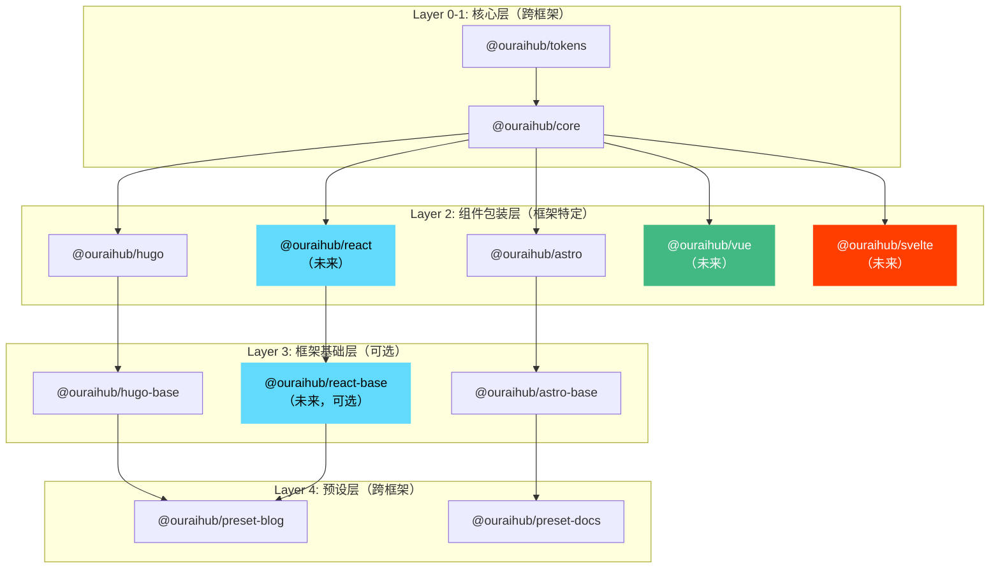

# 框架扩展路径设计

> **版本**: 1.0.0  
> **创建日期**: 2026-05-12  
> **状态**: approved  
> **维护者**: Sisyphus (AI Agent)

## 概述

本文档定义 @ouraihub/ui-library 的框架扩展路径，确保架构能够支持未来添加 React、Vue、Svelte 等框架，而不需要大规模重构。

**设计原则**：
- 核心逻辑（Layer 1）100% 跨框架复用
- 框架包装（Layer 2）保持薄包装模式
- 扩展新框架不影响现有框架
- 保持架构一致性

---

## 当前架构状态

### 已支持的框架

**Layer 2（组件包装层）**：
- `@ouraihub/hugo` - Hugo partials
- `@ouraihub/astro` - Astro components

**Layer 3（框架基础层）**：
- `@ouraihub/hugo-base` - Hugo 框架基础
- `@ouraihub/astro-base` - Astro 框架基础

**Layer 5（完整主题层）**：
- `@ouraihub/hugo-theme-blog` - Hugo 博客主题
- `@ouraihub/astro-theme-docs` - Astro 文档主题

---

## 扩展路径设计

### 扩展原则

1. **核心复用**: 所有框架共享 Layer 0（tokens）和 Layer 1（core）
2. **独立包装**: 每个框架有独立的 Layer 2 包装包
3. **可选基础**: Layer 3（base）是可选的，简单项目可跳过
4. **灵活主题**: Layer 5（theme）可跨框架借鉴设计，但实现独立

### 架构扩展图



---

## React 扩展设计

### 包结构

```
packages/
├── react/                    # Layer 2: React 组件包装
│   ├── src/
│   │   ├── components/
│   │   │   ├── ThemeToggle.tsx
│   │   │   ├── SearchModal.tsx
│   │   │   ├── Navigation.tsx
│   │   │   └── LazyImage.tsx
│   │   ├── hooks/
│   │   │   ├── useTheme.ts
│   │   │   ├── useSearch.ts
│   │   │   └── useNavigation.ts
│   │   └── index.ts
│   ├── package.json
│   └── tsconfig.json
│
└── react-base/               # Layer 3: React 框架基础（可选）
    ├── src/
    │   ├── layouts/
    │   │   ├── BaseLayout.tsx
    │   │   ├── BlogLayout.tsx
    │   │   └── DocsLayout.tsx
    │   ├── providers/
    │   │   ├── ThemeProvider.tsx
    │   │   └── UIProvider.tsx
    │   └── index.ts
    ├── package.json
    └── tsconfig.json
```

### 组件设计

#### ThemeToggle 组件

```tsx
// packages/react/src/components/ThemeToggle.tsx
import { useEffect, useState } from 'react';
import { ThemeManager, type ThemeMode } from '@ouraihub/core/theme';

export interface ThemeToggleProps {
  storageKey?: string;
  attribute?: string;
  defaultTheme?: ThemeMode;
  className?: string;
}

export function ThemeToggle({
  storageKey = 'theme',
  attribute = 'data-theme',
  defaultTheme = 'system',
  className = '',
}: ThemeToggleProps) {
  const [theme, setTheme] = useState<ThemeMode>(defaultTheme);
  const [manager] = useState(() => new ThemeManager(undefined, {
    storageKey,
    attribute,
    defaultTheme,
  }));
  
  useEffect(() => {
    // 订阅主题变化
    const unsubscribe = manager.onThemeChange((newTheme) => {
      setTheme(newTheme as ThemeMode);
    });
    
    // 初始化主题
    setTheme(manager.getTheme());
    
    return unsubscribe;
  }, [manager]);
  
  const handleToggle = () => {
    manager.toggle();
  };
  
  return (
    <button
      onClick={handleToggle}
      className={className}
      aria-label="切换主题"
    >
      {theme === 'dark' ? '🌙' : '☀️'}
    </button>
  );
}
```

#### useTheme Hook

```tsx
// packages/react/src/hooks/useTheme.ts
import { useEffect, useState } from 'react';
import { ThemeManager, type ThemeMode, type ThemeOptions } from '@ouraihub/core/theme';

export function useTheme(options?: ThemeOptions) {
  const [theme, setTheme] = useState<ThemeMode>('system');
  const [manager] = useState(() => new ThemeManager(undefined, options));
  
  useEffect(() => {
    const unsubscribe = manager.onThemeChange((newTheme) => {
      setTheme(newTheme as ThemeMode);
    });
    
    setTheme(manager.getTheme());
    
    return unsubscribe;
  }, [manager]);
  
  return {
    theme,
    setTheme: (mode: ThemeMode) => manager.setTheme(mode),
    toggle: () => manager.toggle(),
  };
}
```

### package.json

```json
{
  "name": "@ouraihub/react",
  "version": "0.1.0",
  "description": "React components for @ouraihub/ui-library",
  "type": "module",
  "main": "./dist/index.js",
  "types": "./dist/index.d.ts",
  "exports": {
    ".": {
      "types": "./dist/index.d.ts",
      "import": "./dist/index.js"
    },
    "./components/*": {
      "types": "./dist/components/*.d.ts",
      "import": "./dist/components/*.js"
    },
    "./hooks/*": {
      "types": "./dist/hooks/*.d.ts",
      "import": "./dist/hooks/*.js"
    }
  },
  "files": [
    "dist"
  ],
  "dependencies": {
    "@ouraihub/core": "workspace:^",
    "@ouraihub/tokens": "workspace:^"
  },
  "peerDependencies": {
    "react": "^18.0.0",
    "react-dom": "^18.0.0"
  },
  "devDependencies": {
    "@types/react": "^18.2.0",
    "@types/react-dom": "^18.2.0",
    "typescript": "^5.3.0"
  },
  "keywords": [
    "react",
    "components",
    "ouraihub",
    "ui-library"
  ],
  "license": "MIT"
}
```

---

## Vue 扩展设计

### 包结构

```
packages/
└── vue/                      # Layer 2: Vue 组件包装
    ├── src/
    │   ├── components/
    │   │   ├── ThemeToggle.vue
    │   │   ├── SearchModal.vue
    │   │   ├── Navigation.vue
    │   │   └── LazyImage.vue
    │   ├── composables/
    │   │   ├── useTheme.ts
    │   │   ├── useSearch.ts
    │   │   └── useNavigation.ts
    │   └── index.ts
    ├── package.json
    └── tsconfig.json
```

### 组件设计

#### ThemeToggle 组件

```vue
<!-- packages/vue/src/components/ThemeToggle.vue -->
<script setup lang="ts">
import { onMounted, onUnmounted, ref } from 'vue';
import { ThemeManager, type ThemeMode, type ThemeOptions } from '@ouraihub/core/theme';

interface Props {
  storageKey?: string;
  attribute?: string;
  defaultTheme?: ThemeMode;
}

const props = withDefaults(defineProps<Props>(), {
  storageKey: 'theme',
  attribute: 'data-theme',
  defaultTheme: 'system',
});

const theme = ref<ThemeMode>(props.defaultTheme);
let manager: ThemeManager;
let unsubscribe: (() => void) | undefined;

onMounted(() => {
  manager = new ThemeManager(undefined, {
    storageKey: props.storageKey,
    attribute: props.attribute,
    defaultTheme: props.defaultTheme,
  });
  
  unsubscribe = manager.onThemeChange((newTheme) => {
    theme.value = newTheme as ThemeMode;
  });
  
  theme.value = manager.getTheme();
});

onUnmounted(() => {
  unsubscribe?.();
});

const handleToggle = () => {
  manager.toggle();
};
</script>

<template>
  <button @click="handleToggle" aria-label="切换主题">
    {{ theme === 'dark' ? '🌙' : '☀️' }}
  </button>
</template>
```

#### useTheme Composable

```typescript
// packages/vue/src/composables/useTheme.ts
import { onMounted, onUnmounted, ref } from 'vue';
import { ThemeManager, type ThemeMode, type ThemeOptions } from '@ouraihub/core/theme';

export function useTheme(options?: ThemeOptions) {
  const theme = ref<ThemeMode>('system');
  let manager: ThemeManager;
  let unsubscribe: (() => void) | undefined;
  
  onMounted(() => {
    manager = new ThemeManager(undefined, options);
    
    unsubscribe = manager.onThemeChange((newTheme) => {
      theme.value = newTheme as ThemeMode;
    });
    
    theme.value = manager.getTheme();
  });
  
  onUnmounted(() => {
    unsubscribe?.();
  });
  
  return {
    theme,
    setTheme: (mode: ThemeMode) => manager.setTheme(mode),
    toggle: () => manager.toggle(),
  };
}
```

---

## Svelte 扩展设计

### 包结构

```
packages/
└── svelte/                   # Layer 2: Svelte 组件包装
    ├── src/
    │   ├── components/
    │   │   ├── ThemeToggle.svelte
    │   │   ├── SearchModal.svelte
    │   │   ├── Navigation.svelte
    │   │   └── LazyImage.svelte
    │   └── index.ts
    ├── package.json
    └── tsconfig.json
```

### 组件设计

#### ThemeToggle 组件

```svelte
<!-- packages/svelte/src/components/ThemeToggle.svelte -->
<script lang="ts">
  import { onMount, onDestroy } from 'svelte';
  import { ThemeManager, type ThemeMode, type ThemeOptions } from '@ouraihub/core/theme';
  
  export let storageKey: string = 'theme';
  export let attribute: string = 'data-theme';
  export let defaultTheme: ThemeMode = 'system';
  
  let theme: ThemeMode = defaultTheme;
  let manager: ThemeManager;
  let unsubscribe: (() => void) | undefined;
  
  onMount(() => {
    manager = new ThemeManager(undefined, {
      storageKey,
      attribute,
      defaultTheme,
    });
    
    unsubscribe = manager.onThemeChange((newTheme) => {
      theme = newTheme as ThemeMode;
    });
    
    theme = manager.getTheme();
  });
  
  onDestroy(() => {
    unsubscribe?.();
  });
  
  function handleToggle() {
    manager.toggle();
  }
</script>

<button on:click={handleToggle} aria-label="切换主题">
  {theme === 'dark' ? '🌙' : '☀️'}
</button>
```

---

## 扩展决策矩阵

### 何时需要 Layer 3（Base）包？

| 框架 | 是否需要 Base | 理由 |
|------|--------------|------|
| **Hugo** | ✅ 需要 | Hugo 需要布局模板、partials 组织 |
| **Astro** | ✅ 需要 | Astro 需要布局、集成配置 |
| **React** | ❓ 可选 | 简单项目可直接使用组件，复杂项目可能需要 Provider、Layout |
| **Vue** | ❓ 可选 | 简单项目可直接使用组件，复杂项目可能需要 Plugin、Layout |
| **Svelte** | ❌ 不需要 | Svelte 组件足够灵活，通常不需要额外的 Base 层 |

**决策原则**：
- SSG 框架（Hugo、Astro）→ 需要 Base（布局系统）
- SPA 框架（React、Vue、Svelte）→ 可选 Base（根据复杂度）

---

## 实施优先级

### Phase 1: 当前支持（已完成）
- ✅ Hugo（Layer 2 + Layer 3）
- ✅ Astro（Layer 2 + Layer 3）

### Phase 2: 高优先级扩展
- 🔄 React（Layer 2，Base 可选）
  - 理由：React 生态最大，用户需求最高
  - 预计工作量：1-2 周

### Phase 3: 中优先级扩展
- ⏳ Vue（Layer 2，Base 可选）
  - 理由：Vue 在国内流行，有一定用户基础
  - 预计工作量：1-2 周

### Phase 4: 低优先级扩展
- ⏳ Svelte（Layer 2）
  - 理由：Svelte 生态较小，但技术先进
  - 预计工作量：1 周

---

## 扩展检查清单

添加新框架时，确保完成以下步骤：

### 1. 核心包装（Layer 2）
- [ ] 创建 `packages/{framework}/` 目录
- [ ] 实现核心组件包装（ThemeToggle、SearchModal 等）
- [ ] 提供 Hooks/Composables（如果适用）
- [ ] 编写 TypeScript 类型定义
- [ ] 配置 package.json 和构建脚本

### 2. 测试
- [ ] 单元测试（组件渲染、事件处理）
- [ ] 集成测试（与 core 包的集成）
- [ ] E2E 测试（真实项目中的使用）

### 3. 文档
- [ ] README.md（安装、使用、API）
- [ ] 使用示例（至少 3 个）
- [ ] 迁移指南（从其他框架迁移）
- [ ] 更新主文档（DESIGN.md）

### 4. 生态集成
- [ ] 更新 CLI（支持新框架脚手架）
- [ ] 更新 Preset（确保跨框架兼容）
- [ ] 更新依赖关系图
- [ ] 更新包结构文档

### 5. 发布
- [ ] 配置 npm 发布
- [ ] 添加到 Monorepo 构建流程
- [ ] 更新 CHANGELOG
- [ ] 发布公告

---

## 跨框架一致性

### API 一致性

所有框架的组件应该提供**一致的 API**：

```typescript
// React
<ThemeToggle storageKey="theme" defaultTheme="system" />

// Vue
<ThemeToggle storage-key="theme" default-theme="system" />

// Svelte
<ThemeToggle storageKey="theme" defaultTheme="system" />

// Astro
<ThemeToggle storageKey="theme" defaultTheme="system" />
```

### 行为一致性

所有框架的组件应该有**一致的行为**：
- 相同的事件触发时机
- 相同的状态管理逻辑
- 相同的错误处理方式
- 相同的无障碍支持

### 文档一致性

所有框架的文档应该有**一致的结构**：
- 安装
- 快速开始
- API 参考
- 使用示例
- 常见问题

---

## 相关文档

- [六层架构设计](../decisions/005-six-layer-architecture.md) - 架构层次定义
- [包依赖关系](./03-package-dependencies.md) - 当前依赖关系
- [实施路线图](../implementation/01-roadmap.md) - 实施计划

---

**维护者**: Sisyphus (AI Agent)  
**最后更新**: 2026-05-12
