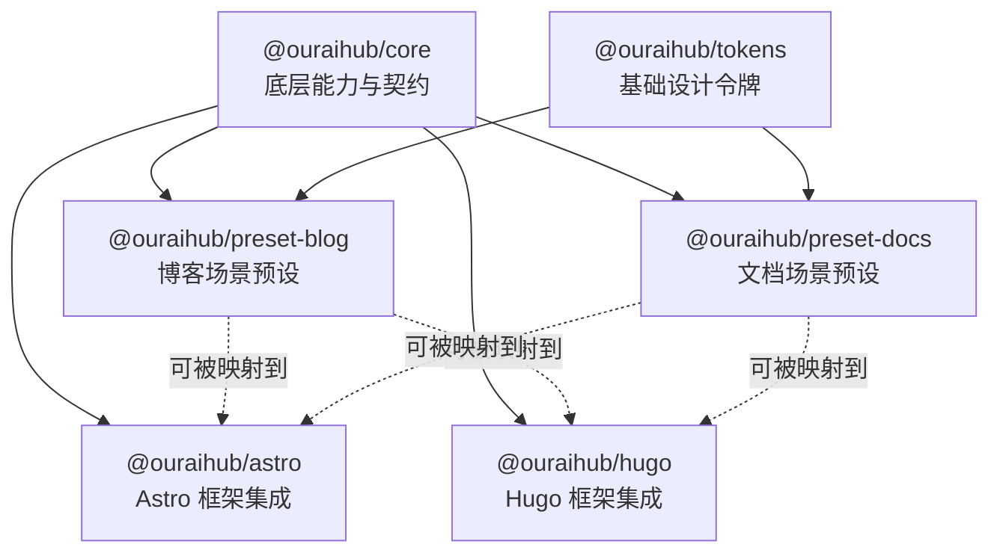

# Package Relationship Guide

This document explains the relationship between:

- `@ouraihub/core`
- `@ouraihub/tokens`
- `@ouraihub/preset-blog`
- `@ouraihub/preset-docs`
- `@ouraihub/astro`
- `@ouraihub/hugo`

## One-sentence summary

The presets define the site scenario and default behavior, while Astro and Hugo are framework-specific integration layers that render or consume those ideas.

## Relationship diagram



## Role of each package

### `@ouraihub/core`

This is the foundation layer.

It provides:

- shared logic
- type contracts
- preset type definitions
- lower-level feature modules

In the current repository, the `Preset` contract comes from:

- [packages/core/src/preset/types.ts](E:/workspace/ui-dev/ui-library/packages/core/src/preset/types.ts)

That contract is framework-agnostic. It defines:

- `options`
- `tokens`
- `components`
- `layout`
- `plugins`
- `tools`

This means the preset layer is not tied to Astro or Hugo by type design.

### `@ouraihub/tokens`

This is the base design-token layer.

It provides shared visual primitives such as:

- color tokens
- spacing tokens
- typography tokens
- radius, shadow, transition values

The preset packages build on top of these tokens or align with the same token model.

### `@ouraihub/preset-blog`

This package defines a blog-oriented preset.

It is not a framework runtime by itself.

It mainly describes:

- blog-specific design tokens
- blog-oriented component defaults
- blog page layout ideas

Examples of real concepts present in the source:

- `ArticleCard`
- `Tag`
- `Pagination`
- `Comments`
- `TableOfContents`
- `AuthorBio`
- `RelatedPosts`
- home/article/archive/tags layout patterns

So it is best understood as:

- a scenario preset
- a configuration blueprint
- a content-site default model

### `@ouraihub/preset-docs`

This package defines a documentation-site preset.

It is also not a framework runtime by itself.

It mainly describes:

- docs-specific design tokens
- documentation-oriented component defaults
- docs layout patterns

Examples of real concepts present in the source:

- `Sidebar`
- `TableOfContents`
- `CodeBlock`
- `Callout`
- `Breadcrumb`
- `SearchModal`
- `ApiReference`
- docs/api/search/full-width layout variants

So it is best understood as:

- a docs preset
- a configuration blueprint
- a technical-content site default model

### `@ouraihub/astro`

This package is the Astro integration layer.

Current repository reality:

- it is framework-specific
- it currently exports Astro-facing functionality
- it does not yet represent the complete preset runtime for all preset concepts

For example, at the moment the source export surface is very small:

- [packages/astro/src/index.ts](E:/workspace/ui-dev/ui-library/packages/astro/src/index.ts)

This means Astro support exists, but the preset-to-Astro mapping is not yet a fully realized end-to-end product surface.

### `@ouraihub/hugo`

This package is the Hugo integration layer.

Current repository reality:

- it provides Hugo-specific partials and assets
- it is more like a Hugo adapter layer than a complete preset runtime

Examples visible in the package today:

- `theme-toggle.html`
- `search-modal.html`
- `navigation.html`
- `seo-meta.html`
- `seo-schema.html`

So Hugo support exists, but it is not yet a fully automatic “install preset and get a whole finished site” system.

## Are the preset packages exclusive with Astro or Hugo?

No.

They are not mutually exclusive.

The cleanest way to think about the system is:

1. scenario dimension
   - `preset-blog`
   - `preset-docs`

2. framework dimension
   - `astro`
   - `hugo`

That creates four conceptual combinations:

- blog + astro
- blog + hugo
- docs + astro
- docs + hugo

So the relationship is combinational, not exclusive.

## Important nuance: conceptually compatible vs fully implemented

This is the most important distinction.

### Conceptually

The architecture clearly suggests that presets should be able to work with both Astro and Hugo.

### In current implementation

The repository is not yet a fully seamless preset runtime system across both frameworks.

More precisely:

- `core` and preset contracts are defined
- scenario presets exist
- Astro and Hugo integration packages exist
- but the full preset-to-framework glue is not yet completely productized

So the current state is better described as:

```text
Preset layer: defined
Framework integration layer: partially implemented
Preset -> framework automatic application: not yet complete
```

## Practical interpretation

If you ask “what decides site style?”, the answer is:

- `@ouraihub/preset-blog`
- `@ouraihub/preset-docs`

If you ask “what decides which framework I am using?”, the answer is:

- `@ouraihub/astro`
- `@ouraihub/hugo`

If you ask “can I directly install a preset and get a full production-ready Astro or Hugo site right now?”, the honest answer is:

- not fully yet

The current codebase is closer to:

- a layered architecture with the right direction
- partial framework implementations
- preset definitions that still need more runtime glue for complete out-of-the-box usage

## Mental model

Use this simplified model:

| Package | Role | Mental model |
|---|---|---|
| `@ouraihub/core` | foundation | engine |
| `@ouraihub/tokens` | design primitives | visual base layer |
| `@ouraihub/preset-blog` | blog scenario | blog blueprint |
| `@ouraihub/preset-docs` | docs scenario | docs blueprint |
| `@ouraihub/astro` | Astro integration | Astro adapter |
| `@ouraihub/hugo` | Hugo integration | Hugo adapter |

## Direct answer to the original question

`@ouraihub/preset-blog` and `@ouraihub/preset-docs` are not exclusive with `@ouraihub/astro` or `@ouraihub/hugo`.

They represent scenario presets, while Astro and Hugo represent framework integrations.

They are meant to work across layers, but the repository does not yet fully implement the whole preset-to-framework automation path as a polished out-of-the-box product.
