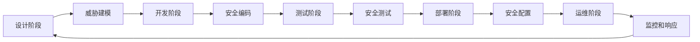

# 安全性文档

> **版本**: 1.4.0  
> **最后更新**: 2026-05-12  
> **状态**: active  
> **维护者**: Sisyphus (AI Agent)

本文档定义 `@ouraihub/ui-library` 的安全策略、威胁模型、防护措施和最佳实践。

---

## 目录

- [安全原则](#安全原则)
- [威胁模型](#威胁模型)
- [XSS 防护](#xss-防护)
- [CSRF 防护](#csrf-防护)
- [内容安全策略（CSP）](#内容安全策略csp)
- [依赖安全](#依赖安全)
- [数据保护](#数据保护)
- [安全审计](#安全审计)

---

## 安全原则

### 核心原则

1. **纵深防御（Defense in Depth）** - 多层安全措施，不依赖单一防护
2. **最小权限原则** - 只请求必需的权限和数据
3. **默认安全** - 安全配置应该是默认的，而非可选的
4. **输入验证** - 永远不信任用户输入
5. **输出编码** - 所有输出到 DOM 的内容都应该被编码
6. **安全更新** - 及时更新依赖，修复已知漏洞

### 安全开发生命周期



---

## 威胁模型

### STRIDE 威胁分类

| 威胁类型 | 描述 | 影响 | 缓解措施 |
|---------|------|------|---------|
| **Spoofing（欺骗）** | 攻击者冒充合法用户 | 未授权访问 | 身份验证、Token 验证 |
| **Tampering（篡改）** | 修改数据或代码 | 数据完整性破坏 | 输入验证、完整性检查 |
| **Repudiation（抵赖）** | 否认执行的操作 | 审计失效 | 日志记录、不可否认性 |
| **Information Disclosure（信息泄露）** | 暴露敏感信息 | 隐私泄露 | 加密、访问控制 |
| **Denial of Service（拒绝服务）** | 使服务不可用 | 可用性丧失 | 速率限制、资源限制 |
| **Elevation of Privilege（权限提升）** | 获得未授权的权限 | 系统控制 | 权限检查、最小权限 |

### 组件库特定威胁

#### 1. XSS 攻击

**场景**: 用户输入的内容被直接渲染到 DOM

```typescript
// ❌ 危险：直接插入 HTML
element.innerHTML = userInput;

// ✅ 安全：使用 textContent
element.textContent = userInput;
```

#### 2. 原型污染

**场景**: 恶意修改 Object.prototype

```typescript
// ❌ 危险：不安全的对象合并
function merge(target, source) {
  for (let key in source) {
    target[key] = source[key];
  }
}

// ✅ 安全：检查 hasOwnProperty
function merge(target, source) {
  for (let key in source) {
    if (Object.prototype.hasOwnProperty.call(source, key)) {
      target[key] = source[key];
    }
  }
}
```

#### 3. localStorage 注入

**场景**: 从 localStorage 读取的数据被信任

```typescript
// ❌ 危险：直接使用 localStorage 数据
const theme = localStorage.getItem('theme');
document.documentElement.setAttribute('data-theme', theme);

// ✅ 安全：验证后使用
const theme = localStorage.getItem('theme');
const validThemes = ['light', 'dark', 'auto'];
if (validThemes.includes(theme)) {
  document.documentElement.setAttribute('data-theme', theme);
}
```

---

## XSS 防护

### XSS 类型

| 类型 | 描述 | 防护方法 |
|------|------|---------|
| **存储型 XSS** | 恶意脚本存储在服务器 | 输入验证 + 输出编码 |
| **反射型 XSS** | 恶意脚本在 URL 参数中 | URL 参数验证 + 编码 |
| **DOM 型 XSS** | 客户端脚本直接操作 DOM | 安全的 DOM API |

### 输入验证

```typescript
/**
 * 验证和清理用户输入
 */
export class InputValidator {
  /**
   * 验证字符串长度
   */
  static validateLength(
    input: string,
    min: number,
    max: number
  ): boolean {
    return input.length >= min && input.length <= max;
  }

  /**
   * 验证字符白名单
   */
  static validateWhitelist(
    input: string,
    allowedChars: RegExp
  ): boolean {
    return allowedChars.test(input);
  }

  /**
   * 清理 HTML 标签
   */
  static stripHtml(input: string): string {
    const div = document.createElement('div');
    div.textContent = input;
    return div.innerHTML;
  }

  /**
   * 清理危险字符
   */
  static sanitize(input: string): string {
    return input
      .replace(/</g, '&lt;')
      .replace(/>/g, '&gt;')
      .replace(/"/g, '&quot;')
      .replace(/'/g, '&#x27;')
      .replace(/\//g, '&#x2F;');
  }
}
```

### 输出编码

```typescript
/**
 * 安全的 DOM 操作工具
 */
export class SafeDOM {
  /**
   * 安全地设置文本内容
   */
  static setText(element: Element, text: string): void {
    element.textContent = text;
  }

  /**
   * 安全地设置属性
   */
  static setAttribute(
    element: Element,
    name: string,
    value: string
  ): void {
    // 验证属性名
    const dangerousAttrs = ['onclick', 'onerror', 'onload'];
    if (dangerousAttrs.includes(name.toLowerCase())) {
      throw new Error(`Dangerous attribute: ${name}`);
    }

    // 编码属性值
    const encoded = value
      .replace(/"/g, '&quot;')
      .replace(/'/g, '&#x27;');
    
    element.setAttribute(name, encoded);
  }

  /**
   * 安全地创建元素
   */
  static createElement<K extends keyof HTMLElementTagNameMap>(
    tagName: K,
    attributes?: Record<string, string>,
    textContent?: string
  ): HTMLElementTagNameMap[K] {
    const element = document.createElement(tagName);

    if (attributes) {
      for (const [name, value] of Object.entries(attributes)) {
        this.setAttribute(element, name, value);
      }
    }

    if (textContent) {
      this.setText(element, textContent);
    }

    return element;
  }
}
```

### DOMPurify 集成

对于需要支持富文本的场景，使用 DOMPurify：

```typescript
import DOMPurify from 'dompurify';

/**
 * 清理 HTML 内容
 */
export function sanitizeHtml(
  html: string,
  options?: DOMPurify.Config
): string {
  return DOMPurify.sanitize(html, {
    ALLOWED_TAGS: ['p', 'br', 'strong', 'em', 'a'],
    ALLOWED_ATTR: ['href', 'title'],
    ALLOW_DATA_ATTR: false,
    ...options,
  });
}

// 使用示例
const userHtml = '<p>Hello <script>alert("XSS")</script></p>';
const safeHtml = sanitizeHtml(userHtml);
// 结果: '<p>Hello </p>'
```

---

## CSRF 防护

### CSRF Token

虽然组件库主要是客户端代码，但如果涉及 API 调用，应该支持 CSRF 保护：

```typescript
/**
 * CSRF Token 管理器
 */
export class CSRFTokenManager {
  private token: string | null = null;

  /**
   * 从 meta 标签获取 token
   */
  getToken(): string | null {
    if (!this.token) {
      const meta = document.querySelector<HTMLMetaElement>(
        'meta[name="csrf-token"]'
      );
      this.token = meta?.content || null;
    }
    return this.token;
  }

  /**
   * 为请求添加 CSRF token
   */
  addTokenToRequest(init: RequestInit = {}): RequestInit {
    const token = this.getToken();
    
    if (!token) {
      console.warn('CSRF token not found');
      return init;
    }

    return {
      ...init,
      headers: {
        ...init.headers,
        'X-CSRF-Token': token,
      },
    };
  }
}

// 使用示例
const csrfManager = new CSRFTokenManager();

fetch('/api/data', csrfManager.addTokenToRequest({
  method: 'POST',
  body: JSON.stringify(data),
}));
```

### SameSite Cookie

确保应用使用 SameSite cookie 属性：

```http
Set-Cookie: session=abc123; SameSite=Strict; Secure; HttpOnly
```

---

## 内容安全策略（CSP）

### CSP 配置

推荐的 CSP 配置：

```html
<meta http-equiv="Content-Security-Policy" content="
  default-src 'self';
  script-src 'self' 'unsafe-inline';
  style-src 'self' 'unsafe-inline';
  img-src 'self' data: https:;
  font-src 'self' data:;
  connect-src 'self';
  frame-ancestors 'none';
  base-uri 'self';
  form-action 'self';
">
```

### CSP 指令说明

| 指令 | 说明 | 推荐值 |
|------|------|--------|
| `default-src` | 默认策略 | `'self'` |
| `script-src` | JavaScript 来源 | `'self'` |
| `style-src` | CSS 来源 | `'self' 'unsafe-inline'` |
| `img-src` | 图片来源 | `'self' data: https:` |
| `connect-src` | XHR/Fetch 来源 | `'self'` |
| `frame-ancestors` | 可嵌入的父页面 | `'none'` |

### Nonce 支持

对于内联脚本，使用 nonce 而非 `'unsafe-inline'`：

```typescript
/**
 * 生成 CSP nonce
 */
export function generateNonce(): string {
  const array = new Uint8Array(16);
  crypto.getRandomValues(array);
  return btoa(String.fromCharCode(...array));
}

/**
 * 添加带 nonce 的脚本
 */
export function addScriptWithNonce(
  code: string,
  nonce: string
): HTMLScriptElement {
  const script = document.createElement('script');
  script.nonce = nonce;
  script.textContent = code;
  document.head.appendChild(script);
  return script;
}
```

---

## 依赖安全

### 依赖审计

定期审计依赖的安全漏洞：

```bash
# npm 审计
npm audit

# 修复可自动修复的漏洞
npm audit fix

# pnpm 审计
pnpm audit

# 生成审计报告
pnpm audit --json > audit-report.json
```

### 依赖锁定

使用 `package-lock.json` 或 `pnpm-lock.yaml` 锁定依赖版本：

```json
{
  "scripts": {
    "preinstall": "npx only-allow pnpm",
    "postinstall": "pnpm audit"
  }
}
```

### 依赖最小化

```typescript
// ❌ 导入整个库
import _ from 'lodash';

// ✅ 只导入需要的函数
import debounce from 'lodash/debounce';
```

### Subresource Integrity (SRI)

对于 CDN 资源，使用 SRI：

```html
<script
  src="https://cdn.example.com/library.js"
  integrity="sha384-oqVuAfXRKap7fdgcCY5uykM6+R9GqQ8K/uxy9rx7HNQlGYl1kPzQho1wx4JwY8wC"
  crossorigin="anonymous"
></script>
```

---

## 数据保护

### 敏感数据处理

```typescript
/**
 * 敏感数据管理器
 */
export class SensitiveDataManager {
  /**
   * 不要在 localStorage 存储敏感数据
   */
  static shouldNotStore(key: string): boolean {
    const sensitiveKeys = [
      'password',
      'token',
      'secret',
      'apiKey',
      'creditCard',
    ];
    
    return sensitiveKeys.some(k => 
      key.toLowerCase().includes(k.toLowerCase())
    );
  }

  /**
   * 安全地存储数据
   */
  static store(key: string, value: string): void {
    if (this.shouldNotStore(key)) {
      throw new Error(`Cannot store sensitive data: ${key}`);
    }
    
    try {
      localStorage.setItem(key, value);
    } catch (error) {
      console.error('Failed to store data:', error);
    }
  }

  /**
   * 清理敏感数据
   */
  static clear(): void {
    localStorage.clear();
    sessionStorage.clear();
  }
}
```

### 数据加密

对于必须存储的敏感数据，使用加密：

```typescript
/**
 * 简单的数据加密（使用 Web Crypto API）
 */
export class DataEncryption {
  private static async getKey(password: string): Promise<CryptoKey> {
    const encoder = new TextEncoder();
    const keyMaterial = await crypto.subtle.importKey(
      'raw',
      encoder.encode(password),
      'PBKDF2',
      false,
      ['deriveBits', 'deriveKey']
    );

    return crypto.subtle.deriveKey(
      {
        name: 'PBKDF2',
        salt: encoder.encode('salt'),
        iterations: 100000,
        hash: 'SHA-256',
      },
      keyMaterial,
      { name: 'AES-GCM', length: 256 },
      false,
      ['encrypt', 'decrypt']
    );
  }

  static async encrypt(
    data: string,
    password: string
  ): Promise<string> {
    const encoder = new TextEncoder();
    const key = await this.getKey(password);
    const iv = crypto.getRandomValues(new Uint8Array(12));

    const encrypted = await crypto.subtle.encrypt(
      { name: 'AES-GCM', iv },
      key,
      encoder.encode(data)
    );

    const combined = new Uint8Array(iv.length + encrypted.byteLength);
    combined.set(iv);
    combined.set(new Uint8Array(encrypted), iv.length);

    return btoa(String.fromCharCode(...combined));
  }

  static async decrypt(
    encryptedData: string,
    password: string
  ): Promise<string> {
    const decoder = new TextDecoder();
    const key = await this.getKey(password);
    
    const combined = Uint8Array.from(
      atob(encryptedData),
      c => c.charCodeAt(0)
    );
    
    const iv = combined.slice(0, 12);
    const data = combined.slice(12);

    const decrypted = await crypto.subtle.decrypt(
      { name: 'AES-GCM', iv },
      key,
      data
    );

    return decoder.decode(decrypted);
  }
}
```

### 数据清理

```typescript
/**
 * 在组件销毁时清理数据
 */
export class ThemeManager {
  destroy(): void {
    // 清理事件监听器
    this.removeAllListeners();
    
    // 清理 DOM 引用
    this.element = null;
    
    // 不清理 localStorage（用户偏好应该保留）
    // 但如果是敏感数据，应该清理
  }
}
```

---

## 安全审计

### 代码审计清单

#### 输入验证
- [ ] 所有用户输入都经过验证
- [ ] 使用白名单而非黑名单
- [ ] 验证数据类型、长度、格式
- [ ] 拒绝无效输入，不尝试修复

#### 输出编码
- [ ] 使用 `textContent` 而非 `innerHTML`
- [ ] 属性值经过编码
- [ ] URL 参数经过编码
- [ ] 富文本使用 DOMPurify

#### 身份验证和授权
- [ ] 不在客户端存储密码
- [ ] Token 存储在 httpOnly cookie
- [ ] 实现 CSRF 保护
- [ ] 会话超时机制

#### 数据保护
- [ ] 敏感数据不存储在 localStorage
- [ ] 使用 HTTPS 传输数据
- [ ] 实现数据加密（如需要）
- [ ] 定期清理敏感数据

#### 依赖安全
- [ ] 定期运行 `npm audit`
- [ ] 及时更新依赖
- [ ] 使用 SRI 保护 CDN 资源
- [ ] 最小化依赖数量

#### CSP
- [ ] 配置严格的 CSP
- [ ] 避免 `'unsafe-inline'` 和 `'unsafe-eval'`
- [ ] 使用 nonce 或 hash
- [ ] 测试 CSP 配置

### 自动化安全测试

```typescript
// vitest.config.ts
export default defineConfig({
  test: {
    // 安全测试
    include: ['**/*.security.test.ts'],
  },
});
```

```typescript
// theme-manager.security.test.ts
import { describe, it, expect } from 'vitest';
import { ThemeManager } from '../theme-manager';

describe('ThemeManager 安全测试', () => {
  it('应该拒绝 XSS 攻击', () => {
    const theme = new ThemeManager();
    
    expect(() => {
      theme.setTheme('<script>alert("XSS")</script>' as any);
    }).toThrow();
  });

  it('应该清理 localStorage 注入', () => {
    localStorage.setItem('theme', '');
    
    const theme = new ThemeManager();
    const currentTheme = theme.getTheme();
    
    // 应该回退到默认值
    expect(currentTheme).toBe('auto');
  });

  it('应该防止原型污染', () => {
    const theme = new ThemeManager();
    
    expect(() => {
      theme.setTheme('__proto__' as any);
    }).toThrow();
  });
});
```

### 渗透测试

定期进行渗透测试，检查：

1. **XSS 漏洞** - 尝试注入脚本
2. **CSRF 漏洞** - 尝试跨站请求伪造
3. **点击劫持** - 检查 X-Frame-Options
4. **开放重定向** - 检查 URL 重定向
5. **信息泄露** - 检查错误消息和堆栈跟踪

---

## 安全事件响应

### 漏洞报告流程

1. **接收报告** - 通过 security@example.com
2. **确认漏洞** - 24 小时内响应
3. **评估影响** - 确定严重程度
4. **开发补丁** - 优先修复
5. **发布更新** - 通知用户
6. **公开披露** - 90 天后（如适用）

### 严重程度分类

| 级别 | 描述 | 响应时间 | 示例 |
|------|------|---------|------|
| **Critical** | 远程代码执行 | 24 小时 | RCE, SQL 注入 |
| **High** | 数据泄露 | 7 天 | XSS, CSRF |
| **Medium** | 功能绕过 | 30 天 | 权限提升 |
| **Low** | 信息泄露 | 90 天 | 版本泄露 |

---

## 安全最佳实践总结

### ✅ 应该做的

1. **验证所有输入** - 永远不信任用户输入
2. **编码所有输出** - 使用安全的 DOM API
3. **使用 CSP** - 配置严格的内容安全策略
4. **定期审计依赖** - 及时更新和修复漏洞
5. **加密敏感数据** - 使用 Web Crypto API
6. **实施 HTTPS** - 所有通信使用加密
7. **最小权限原则** - 只请求必需的权限
8. **安全测试** - 编写安全相关的测试用例

### ❌ 不应该做的

1. **信任用户输入** - 不验证就使用
2. **使用 innerHTML** - 直接插入用户内容
3. **存储敏感数据** - 在 localStorage 存储密码/token
4. **忽略安全警告** - npm audit 的警告
5. **使用 eval()** - 执行动态代码
6. **禁用 CSP** - 为了方便而降低安全性
7. **硬编码密钥** - 在代码中存储密钥
8. **忽略错误** - 空的 catch 块

---

## 相关文档

- [错误处理策略](./error-handling.md) - 安全相关的错误处理
- [测试策略](../testing/README.md) - 安全测试方法
- [API 参考](../api/README.md) - 安全相关的 API
- [部署指南](../deployment/README.md) - 生产环境安全配置

---

## 安全资源

- [OWASP Top 10](https://owasp.org/www-project-top-ten/)
- [MDN Web Security](https://developer.mozilla.org/en-US/docs/Web/Security)
- [Content Security Policy](https://content-security-policy.com/)
- [npm Security Best Practices](https://docs.npmjs.com/security-best-practices)

---

**维护者**: Sisyphus (AI Agent)  
**最后更新**: 2026-05-12
