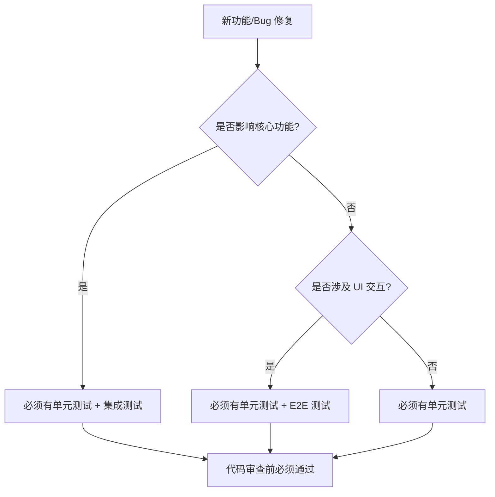

# 测试策略文档

> **版本**: 1.4.0  
> **最后更新**: 2026-05-12  
> **状态**: active  
> **维护者**: Sisyphus (AI Agent)

本文档定义 `@ouraihub/ui-library` 的测试策略、测试类型、覆盖率要求和最佳实践。

---

## 目录

- [测试原则](#测试原则)
- [测试金字塔](#测试金字塔)
- [单元测试](#单元测试)
- [集成测试](#集成测试)
- [E2E 测试](#e2e-测试)
- [覆盖率要求](#覆盖率要求)
- [测试工具链](#测试工具链)
- [CI/CD 集成](#cicd-集成)

---

## 测试原则

### 核心原则

1. **测试行为，不测试实现** - 测试公共 API 和用户可见行为，而非内部实现细节
2. **快速反馈** - 单元测试应在毫秒级完成，集成测试在秒级完成
3. **可靠性** - 测试应该稳定，避免 flaky tests（不稳定测试）
4. **可维护性** - 测试代码应该清晰、简洁，易于理解和修改
5. **隔离性** - 每个测试应该独立运行，不依赖其他测试的状态

### 测试优先级



---

## 测试金字塔

我们遵循标准的测试金字塔模型：

```
        /\
       /  \      E2E 测试 (10%)
      /____\     - 关键用户流程
     /      \    - 跨框架兼容性
    /        \   
   /__________\  集成测试 (30%)
  /            \ - 组件交互
 /              \- 事件通信
/________________\ 单元测试 (60%)
                   - 核心类方法
                   - 工具函数
                   - 边界条件
```

### 测试分布

| 测试类型 | 占比 | 数量目标 | 执行时间 |
|---------|------|---------|---------|
| 单元测试 | 60% | ~200+ | < 5s |
| 集成测试 | 30% | ~100+ | < 30s |
| E2E 测试 | 10% | ~30+ | < 2min |

---

## 单元测试

### 测试范围

单元测试覆盖所有核心类和工具函数的公共 API。

#### 必须测试的内容

- ✅ 所有公共方法的正常路径
- ✅ 边界条件和异常情况
- ✅ 事件触发和回调执行
- ✅ 状态变化和副作用
- ✅ 参数验证和类型检查

#### 不需要测试的内容

- ❌ 私有方法（通过公共 API 间接测试）
- ❌ 第三方库的功能
- ❌ 简单的 getter/setter（除非有业务逻辑）
- ❌ 类型定义（TypeScript 编译器已验证）

### 测试框架

使用 **Vitest** 作为测试运行器和断言库。

```typescript
import { describe, it, expect, beforeEach, afterEach, vi } from 'vitest';
```

### 测试结构

```typescript
describe('ThemeManager', () => {
  let themeManager: ThemeManager;
  let element: HTMLElement;

  beforeEach(() => {
    // 设置测试环境
    element = document.createElement('button');
    themeManager = new ThemeManager(element);
  });

  afterEach(() => {
    // 清理
    themeManager.destroy();
    element.remove();
  });

  describe('constructor', () => {
    it('应该使用默认选项初始化', () => {
      expect(themeManager.getTheme()).toBe('auto');
    });

    it('应该接受自定义选项', () => {
      const custom = new ThemeManager(element, { defaultTheme: 'dark' });
      expect(custom.getTheme()).toBe('dark');
      custom.destroy();
    });
  });

  describe('setTheme', () => {
    it('应该设置主题并触发事件', () => {
      const callback = vi.fn();
      themeManager.onThemeChange(callback);
      
      themeManager.setTheme('dark');
      
      expect(themeManager.getTheme()).toBe('dark');
      expect(callback).toHaveBeenCalledWith('dark', 'dark');
    });

    it('应该持久化到 localStorage', () => {
      themeManager.setTheme('light');
      expect(localStorage.getItem('theme')).toBe('light');
    });
  });

  describe('toggle', () => {
    it('应该在 light 和 dark 之间切换', () => {
      themeManager.setTheme('light');
      themeManager.toggle();
      expect(themeManager.getTheme()).toBe('dark');
      
      themeManager.toggle();
      expect(themeManager.getTheme()).toBe('light');
    });

    it('应该跳过 auto 模式', () => {
      themeManager.setTheme('auto');
      themeManager.toggle();
      expect(themeManager.getTheme()).not.toBe('auto');
    });
  });

  describe('边界条件', () => {
    it('应该处理无效的主题值', () => {
      expect(() => {
        themeManager.setTheme('invalid' as any);
      }).toThrow();
    });

    it('应该处理 null 元素', () => {
      const manager = new ThemeManager();
      expect(() => manager.toggle()).not.toThrow();
      manager.destroy();
    });
  });
});
```

### Mock 和 Stub

#### Mock DOM API

```typescript
import { vi } from 'vitest';

// Mock localStorage
const localStorageMock = {
  getItem: vi.fn(),
  setItem: vi.fn(),
  removeItem: vi.fn(),
  clear: vi.fn(),
};
global.localStorage = localStorageMock as any;

// Mock matchMedia
global.matchMedia = vi.fn().mockImplementation(query => ({
  matches: false,
  media: query,
  onchange: null,
  addListener: vi.fn(),
  removeListener: vi.fn(),
  addEventListener: vi.fn(),
  removeEventListener: vi.fn(),
  dispatchEvent: vi.fn(),
}));
```

#### Mock 时间

```typescript
import { vi } from 'vitest';

beforeEach(() => {
  vi.useFakeTimers();
});

afterEach(() => {
  vi.useRealTimers();
});

it('应该在延迟后执行', () => {
  const callback = vi.fn();
  setTimeout(callback, 1000);
  
  vi.advanceTimersByTime(1000);
  expect(callback).toHaveBeenCalled();
});
```

### 测试覆盖率目标

| 指标 | 目标 | 最低要求 |
|------|------|---------|
| 语句覆盖率 | 90% | 80% |
| 分支覆盖率 | 85% | 75% |
| 函数覆盖率 | 95% | 85% |
| 行覆盖率 | 90% | 80% |

---

## 集成测试

### 测试范围

集成测试验证多个组件之间的交互和通信。

#### 测试场景

- ✅ 组件间事件通信
- ✅ 多个组件共享状态
- ✅ 自动初始化机制
- ✅ Owner-based 订阅清理
- ✅ 框架包装层与核心层的集成

### 测试示例

```typescript
describe('ThemeManager + SearchModal 集成', () => {
  it('应该在主题切换时更新模态框样式', () => {
    const theme = new ThemeManager();
    const modal = new SearchModal(modalElement);
    
    // 订阅主题变化
    theme.onThemeChange((_, resolved) => {
      modalElement.setAttribute('data-theme', resolved);
    });
    
    // 切换主题
    theme.setTheme('dark');
    
    // 验证模态框样式更新
    expect(modalElement.getAttribute('data-theme')).toBe('dark');
    
    // 清理
    theme.destroy();
    modal.destroy();
  });
});
```

### Hugo 包装层集成测试

```typescript
describe('Hugo 自动初始化', () => {
  it('应该自动初始化所有标记的组件', async () => {
    // 设置 HTML
    document.body.innerHTML = `
      <button data-ui-component="theme-toggle"></button>
      <div data-ui-component="search-modal"></div>
    `;
    
    // 导入初始化脚本
    await import('@ouraihub/hugo/init');
    
    // 验证组件已初始化
    const button = document.querySelector('[data-ui-component="theme-toggle"]');
    expect(button).toHaveProperty('__themeManager');
  });
});
```

### Astro 组件集成测试

```typescript
import { experimental_AstroContainer as AstroContainer } from 'astro/container';
import { expect, test } from 'vitest';
import ThemeToggle from '../components/ThemeToggle.astro';

test('ThemeToggle 应该渲染并初始化', async () => {
  const container = await AstroContainer.create();
  const result = await container.renderToString(ThemeToggle);
  
  expect(result).toContain('data-theme-toggle');
  expect(result).toContain('<script>');
});
```

---

## E2E 测试

### 测试范围

E2E 测试验证关键用户流程和跨框架兼容性。

#### 测试场景

- ✅ 主题切换完整流程
- ✅ 搜索模态框打开/关闭/搜索
- ✅ 移动端导航菜单
- ✅ 图片懒加载
- ✅ 键盘导航和无障碍访问

### 测试框架

使用 **Playwright** 进行 E2E 测试。

```typescript
import { test, expect } from '@playwright/test';

test.describe('主题切换', () => {
  test('应该在点击按钮后切换主题', async ({ page }) => {
    await page.goto('http://localhost:3000');
    
    // 初始主题
    const html = page.locator('html');
    await expect(html).toHaveAttribute('data-theme', 'light');
    
    // 点击切换按钮
    await page.click('[data-theme-toggle]');
    
    // 验证主题已切换
    await expect(html).toHaveAttribute('data-theme', 'dark');
    
    // 验证持久化
    await page.reload();
    await expect(html).toHaveAttribute('data-theme', 'dark');
  });

  test('应该响应系统主题偏好', async ({ page, context }) => {
    // 设置系统为暗色模式
    await context.emulateMedia({ colorScheme: 'dark' });
    
    await page.goto('http://localhost:3000');
    
    const html = page.locator('html');
    await expect(html).toHaveAttribute('data-theme', 'dark');
  });
});
```

### 跨框架测试

```typescript
test.describe('跨框架兼容性', () => {
  const frameworks = [
    { name: 'Hugo', url: 'http://localhost:1313' },
    { name: 'Astro', url: 'http://localhost:4321' },
  ];

  for (const { name, url } of frameworks) {
    test(`${name}: 主题切换应该正常工作`, async ({ page }) => {
      await page.goto(url);
      
      await page.click('[data-theme-toggle]');
      const html = page.locator('html');
      await expect(html).toHaveAttribute('data-theme', 'dark');
    });
  }
});
```

### 无障碍测试

```typescript
import { test, expect } from '@playwright/test';
import AxeBuilder from '@axe-core/playwright';

test('应该通过无障碍检查', async ({ page }) => {
  await page.goto('http://localhost:3000');
  
  const accessibilityScanResults = await new AxeBuilder({ page }).analyze();
  
  expect(accessibilityScanResults.violations).toEqual([]);
});
```

### 视觉回归测试

```typescript
test('主题切换不应该破坏布局', async ({ page }) => {
  await page.goto('http://localhost:3000');
  
  // Light 模式截图
  await expect(page).toHaveScreenshot('theme-light.png');
  
  // 切换到 Dark 模式
  await page.click('[data-theme-toggle]');
  
  // Dark 模式截图
  await expect(page).toHaveScreenshot('theme-dark.png');
});
```

---

## 覆盖率要求

### 整体覆盖率目标

```typescript
// vitest.config.ts
export default defineConfig({
  test: {
    coverage: {
      provider: 'v8',
      reporter: ['text', 'json', 'html', 'lcov'],
      lines: 80,
      functions: 85,
      branches: 75,
      statements: 80,
      exclude: [
        'node_modules/',
        'dist/',
        '**/*.test.ts',
        '**/*.spec.ts',
        '**/types/',
      ],
    },
  },
});
```

### 包级别覆盖率要求

| 包 | 语句 | 分支 | 函数 | 行 |
|----|------|------|------|-----|
| @ouraihub/core | 90% | 85% | 95% | 90% |
| @ouraihub/styles | N/A | N/A | N/A | N/A |
| @ouraihub/hugo | 70% | 65% | 75% | 70% |
| @ouraihub/astro | 70% | 65% | 75% | 70% |

**注**: 样式包不需要代码覆盖率，但需要视觉回归测试。

### 覆盖率报告

```bash
# 生成覆盖率报告
pnpm test:coverage

# 查看 HTML 报告
open coverage/index.html
```

---

## 测试工具链

### 核心工具

| 工具 | 用途 | 版本 |
|------|------|------|
| Vitest | 单元测试 + 集成测试 | ^1.0.0 |
| Playwright | E2E 测试 | ^1.40.0 |
| @axe-core/playwright | 无障碍测试 | ^4.8.0 |
| happy-dom | DOM 模拟 | ^12.0.0 |
| @vitest/coverage-v8 | 覆盖率报告 | ^1.0.0 |

### 测试脚本

```json
{
  "scripts": {
    "test": "vitest",
    "test:unit": "vitest run --coverage",
    "test:watch": "vitest watch",
    "test:ui": "vitest --ui",
    "test:e2e": "playwright test",
    "test:e2e:ui": "playwright test --ui",
    "test:coverage": "vitest run --coverage",
    "test:all": "pnpm test:unit && pnpm test:e2e"
  }
}
```

### 配置文件

#### `vitest.config.ts`

```typescript
import { defineConfig } from 'vitest/config';

export default defineConfig({
  test: {
    globals: true,
    environment: 'happy-dom',
    setupFiles: ['./test/setup.ts'],
    coverage: {
      provider: 'v8',
      reporter: ['text', 'json', 'html'],
      lines: 80,
      functions: 85,
      branches: 75,
      statements: 80,
    },
  },
});
```

#### `playwright.config.ts`

```typescript
import { defineConfig, devices } from '@playwright/test';

export default defineConfig({
  testDir: './e2e',
  fullyParallel: true,
  forbidOnly: !!process.env.CI,
  retries: process.env.CI ? 2 : 0,
  workers: process.env.CI ? 1 : undefined,
  reporter: 'html',
  use: {
    baseURL: 'http://localhost:3000',
    trace: 'on-first-retry',
  },
  projects: [
    {
      name: 'chromium',
      use: { ...devices['Desktop Chrome'] },
    },
    {
      name: 'firefox',
      use: { ...devices['Desktop Firefox'] },
    },
    {
      name: 'webkit',
      use: { ...devices['Desktop Safari'] },
    },
    {
      name: 'Mobile Chrome',
      use: { ...devices['Pixel 5'] },
    },
  ],
  webServer: {
    command: 'pnpm dev',
    url: 'http://localhost:3000',
    reuseExistingServer: !process.env.CI,
  },
});
```

---

## CI/CD 集成

### GitHub Actions 工作流

```yaml
name: Test

on:
  push:
    branches: [main, develop]
  pull_request:
    branches: [main, develop]

jobs:
  unit-tests:
    runs-on: ubuntu-latest
    steps:
      - uses: actions/checkout@v4
      - uses: pnpm/action-setup@v2
      - uses: actions/setup-node@v4
        with:
          node-version: 20
          cache: 'pnpm'
      
      - name: Install dependencies
        run: pnpm install
      
      - name: Run unit tests
        run: pnpm test:unit
      
      - name: Upload coverage
        uses: codecov/codecov-action@v3
        with:
          files: ./coverage/lcov.info

  e2e-tests:
    runs-on: ubuntu-latest
    steps:
      - uses: actions/checkout@v4
      - uses: pnpm/action-setup@v2
      - uses: actions/setup-node@v4
        with:
          node-version: 20
          cache: 'pnpm'
      
      - name: Install dependencies
        run: pnpm install
      
      - name: Install Playwright browsers
        run: pnpm exec playwright install --with-deps
      
      - name: Run E2E tests
        run: pnpm test:e2e
      
      - name: Upload test results
        if: always()
        uses: actions/upload-artifact@v3
        with:
          name: playwright-report
          path: playwright-report/
```

### 测试门禁

在 CI 中强制执行测试要求：

```yaml
# .github/workflows/pr-checks.yml
name: PR Checks

on:
  pull_request:
    branches: [main]

jobs:
  test-coverage:
    runs-on: ubuntu-latest
    steps:
      - uses: actions/checkout@v4
      - uses: pnpm/action-setup@v2
      - uses: actions/setup-node@v4
      
      - run: pnpm install
      - run: pnpm test:coverage
      
      - name: Check coverage thresholds
        run: |
          if [ $(jq '.total.lines.pct' coverage/coverage-summary.json | cut -d. -f1) -lt 80 ]; then
            echo "Coverage below 80%"
            exit 1
          fi
```

---

## 最佳实践

### 测试命名

```typescript
// ✅ 好的命名
describe('ThemeManager.setTheme', () => {
  it('应该设置主题并触发 theme-change 事件', () => {});
  it('应该在设置无效主题时抛出错误', () => {});
});

// ❌ 不好的命名
describe('test', () => {
  it('works', () => {});
  it('test2', () => {});
});
```

### AAA 模式

遵循 Arrange-Act-Assert 模式：

```typescript
it('应该切换主题', () => {
  // Arrange - 准备
  const theme = new ThemeManager();
  theme.setTheme('light');
  
  // Act - 执行
  theme.toggle();
  
  // Assert - 断言
  expect(theme.getTheme()).toBe('dark');
});
```

### 避免测试实现细节

```typescript
// ❌ 测试实现细节
it('应该调用 _updateDOM 方法', () => {
  const spy = vi.spyOn(theme as any, '_updateDOM');
  theme.setTheme('dark');
  expect(spy).toHaveBeenCalled();
});

// ✅ 测试行为
it('应该更新 DOM 属性', () => {
  theme.setTheme('dark');
  expect(document.documentElement.getAttribute('data-theme')).toBe('dark');
});
```

### 测试隔离

```typescript
// ✅ 每个测试独立
describe('ThemeManager', () => {
  let theme: ThemeManager;
  
  beforeEach(() => {
    theme = new ThemeManager();
  });
  
  afterEach(() => {
    theme.destroy();
    localStorage.clear();
  });
  
  it('测试 1', () => {
    // 独立的测试
  });
  
  it('测试 2', () => {
    // 不依赖测试 1
  });
});
```

---

## 相关文档

- [API 参考](../api/README.md) - 核心 API 文档
- [错误处理](../guides/error-handling.md) - 错误处理策略
- [代码规范](../contributing/code-style.md) - 代码风格指南
- [CI/CD 配置](../deployment/README.md) - 部署和发布流程

---

**维护者**: Sisyphus (AI Agent)  
**最后更新**: 2026-05-12
